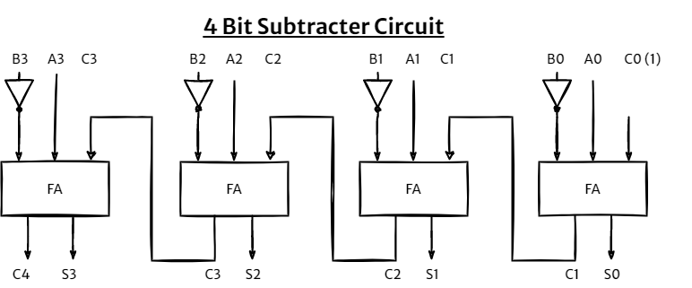

# Table of contents

- [Introduction](#introduction)
- [Numerical Data Representation](#numerical-data-representation)
  - [Decimal](#decimal)
  - [Binary](#binary)
  - [Hexadecimal](#hexadecimal)
  - [Decimal to Binary Conversion](#decimal-to-binary-conversion)
  - [Binary to Decimal Conversion](#binary-to-decimal-conversion)
- [Block Diagram of Computer](#block-diagram-of-computer)
  - [Input Unit:](#input-unit)
  - [Storage Unit:](#storage-unit)
  - [Arithmetic and Logical Unit:](#arithmetic-and-logical-unit)
  - [Control Unit:](#control-unit)
  - [Output Unit:](#output-unit)
- [Common CPU components](#common-cpu-components)
- [Registers](#registers)
- [The fetch-execute cycle](#the-fetch-execute-cycle)
- [Register Transfer Language](#register-transfer-language)
- [Common Bus System and Memory Transfer](#common-bus-system-and-memory-transfer)
- [Common Bus System using Tri State Buffer](#common-bus-system-using-tri-state-buffer)
- [Elementary Micro Operation](#elementary-micro-operation)
- [Arithmetic Micro Operations](#arithmetic-micro-operations)
- [Binary Adder Circuit](#binary-adder-circuit)
- [Binary Subtractor Circuit](#binary-subtractor-circuit)
- [Adder and Subtractor Combinational Circuit](#adder-and-subtractor-combinational-circuit)
- [Binary Incrementer Circuit](#binary-incrementer-circuit)
- [Binary Decrementer Circuit](#binary-decrementer-circuit)
- [Register Shift](#register-shift)
- [Register Shift Circuit](#register-shift-circuit)

# Introduction

- **Computer Architecture** - Computer architecture is concerned with the structure and behavior of the various functional modules of the computer and how they interact to provide the processing needs of the user.
- **Computer Organization** - Computer organization is concerned with the way the hardware components are connected together to form a computer system.

# Numerical Data Representation

- **Decimal Number System**
  - Radix(r) = 10, Number range = 0 - 9
- **Binary Number System**
  - Radix(r) = 2, Number range = 0 - 1
- **Octal Number System**
  - Radix(r) = 8, Number range = 0 - 7
- **Hexadecimal Number System**
  - Radix(r) = 16, Number range = 0 - 9 & A - F

## Decimal

- Decimal digits (0, 1, 2, 3, 4, 5, 6, 7, 8, 9) to represent numbers, and refer to the system as the decimal system. 
- The decimal system is said to have a base, or radix, of 10. This means that each digit in  the  number  is  multiplied  by  10  raised  to  a  power  corresponding  to  that  digits  position

- The same principle holds for decimal fractions, but negative powers of 10 are used. 

- A number with both an integer and fractional part has digits raised to both positive and negative powers of 10

## Binary

In the binary system, we have only two digits, 1 and 0. Thus, numbers in the binary system are represented to base 2. 

## Hexadecimal

hexadecimal (radix 16) , The 16 symbols of the hexadecimal system are 0, 1, 2, 3, 4, 5, 6, 7, 8, 9, A, B, C, 0, E, and F. The last six symbols are, unfortunately, identical to the letters of the alphabet and can cause confusion at times. However, this is the convention that has been adopted.

## Decimal to Binary Conversion

**Converting decimal fraction to binary**

Multiplying with 2 until you get a resulting fractional part equal to zero or you get the desired precision.

## Binary to Decimal Conversion

# Block Diagram of Computer

## Input Unit: 

- Computers need to receive data and instruction in order to solve any problem, so we need to input the data and instructions into the computers. 
- The input unit consists of one or more input devices. Keyboard is the one of the most commonly used input device. Other commonly used input devices are the mouse, floppy disk drive, magnetic tape, microphone etc. 
- Input unit is responsible to take an input and pass the input data to storage unit.

## Storage Unit: 

In computer system storage are divided into two categories.

**Primary Storage:** 

- This memory is generally used to hold the program which is currently being executed. 
- The primary memory is temporary in nature. The data is lost, when the computer is switched off. 
- Example of primary storage is RAM.

**Secondary Storage:** 

- Secondary storage is used like an archive. It stores programs, documents, music, videos databases etc. 
- Example of secondary storages are Hard drives, CDs, Floppy drives etc.,

## Arithmetic and Logical Unit: 

- All calculations and logical decision are performed in the Arithmetic Logic Unit (ALU).
- ALU can perform basic math operation like addition, subtraction, multiplication, division etc.
- It performs the calculation very fast.
- Whenever computer needs to perform any calculation data is passed to ALU.

## Control Unit: 

- It controls all other units in the computer. 
- It controls the flow of data and instructions from the different units of computer. 
- The control unit is generally referred as the central nervous system of the computer that control and synchronizes it’s working.
- The control unit and arithmetic and logical unit of the computer are together known as the Central Processing Unit (CPU). The CPU is like brain of computer system.

## Output Unit: 

- Output unit consist of various output devices like monitor, speaker, printer etc.
- Output unit is responsible to display the processed information. 
- Output can be of any type like display data on screen, print information on printers, audio output by speakers etc.

# Common CPU components

- The central processing unit (CPU) consists of six main components:
  - Control Unit (CU)
  - Arithmetic Logic Unit (ALU)
  - Registers
  - Cache
  - Buses
  - Clock
- All components work together to allow processing and system control.

- **Control Unit (CU)**
  - It issues control signals that control hardware
  - It moves data around the system
- **Arithmetic Logic Unit (ALU)**
  - It performs arithmetic and logical operations (decisions). The ALU is where calculations are done and where decisions are made.
- **Registers**
  - Registers are small amounts of high-speed memory contained within the CPU
- **Cache**
  - Cache is a small amount of high-speed random access memory (RAM) built directly within the processor. 
  - It is used to temporarily hold data and instructions that the processor is likely to reuse. 
  - This allows for faster processing as the processor does not have to wait for the data and instructions to be fetched from the RAM.
- **Buses**
  - A bus is a high-speed internal connection. Buses are used to send control signals and data between the processor and other components.
- **Clock**
  - The CPU contains a clock which is used to coordinate all of the computer's components. 
  - The clock sends out a regular electrical pulse which synchronizes (keeps in time) all the components.
# Registers
- Registers are small amounts of high-speed memory contained within the CPU. 
- They are used by the processor to store small amounts of data that are needed during processing, such as
  - the address of the next instruction to be executed
  - the current instruction being decoded
  - the results of calculations
- Different processors have different numbers of registers for different purposes, but most have some, or all, of the following:

- **Memory Address Register (MAR)**
  - holds the address of the current instruction that is to be fetched from memory, or the address in memory to which data is to be transferred.
- **Current Instruction Register (CIR)**
  - also known as instruction register (IR). holds the instruction that is currently being decoded and executed.
- **Memory Buffer register (MBR) or Memory Data Register (MDR)**
  - holds the contents found at the address held in the MAR, or data which is to be transferred to main memory. It is also referred to as the memory data register (MDR).
- **Program counter (PC)**
  - used to keep the track of execution of the program. It holds the memory address of the next instruction to be fetched from main memory.
- **Accumulator (ACC)**
  - holds the data being processed and the results of processing.

# The fetch-execute cycle

1. The memory address held in the program counter is copied into the MAR.
2. The address in the program counter is then incremented - increased - by one. The program counter now holds the address of the next instruction to be fetched.
3. The processor sends a signal along the address bus to the memory address held in the MAR.
4. The instruction/data held in that memory address is sent along the data bus to the MBR/MDR.
5. The instruction/data held in the MBR/MDR is copied into the CIR.
6. The instruction/data held in the CIR is decoded and then executed. Results of processing are stored in the ACC.
7. The cycle then returns to step one.

# Register Transfer Language

- Digital systems are composed of modules that are constructed from digital components, such as registers, decoders, arithmetic elements, and control logic.
- The modules are interconnected with common data and control paths to form a digital computer system
- The operations executed on data stored in registers are called micro operations.
- A microoperation is an elementary operation performed on the information stored in one or more registers
- shift, count, clear, load etc. are some examples of microoperations.
- A symbolic notation is used to represents the micro operation performed on registers is known as register transfer language.
- We can say it is generalize language that is very close to writing the assembly code which is generally used to write the compilers and other system level programs.
- Registers can be represented in various ways.
  - Designate register by capital letters followed by number if there are multiple registers. Diagram (a)
    E.g. R1, R2, MAR, MDR, PC1, PC2 etc.
  - We can also show the individual of a register Diagram (b)
  - Display the bit range. Diagram (c)
  - Divide the register bits into two parts. Diagram (d)

- Designate information transfer from one register to another by
  R2 ← R1
- This statement indicates that the data of R1 register will be copied to R2 register.
  R4 ← R2
- This statement indicates that the data of R2 register will be copied to R4 register.
- **Note**: this does not erase the content of origin register (i.e. R1 and R2 in above example)

- If microoperation is to occur only under predetermined  control condition, it is designated by if … then statement.

If (P=1) then (R2 ← R1)
Or
P: R2 ← R1

> Block diagram of conditional register transfer

> Timing Diagram

> Various symbols used in Register transfer language

# Common Bus System and Memory Transfer

In digital system there are so many registers. It is impractical to have data lines and control lines directly allow each registers to communicate with all other registers directly. It will need so many lines to connect all registers like this.

Instead we can take different approach. Have a centralize line known as bus to transfer the data and a control circuit which generate the signal to select the register of which the data will be transferred.

We can construct this bus system by using Multiplexers. Below is the Bus system for 4 Registers with the size of 4bit. Here we can use select line s1 and s2 to select the register. Data of selected register will be available through the bus.

> Bus system for 4 Registers each size of 4bits & Signal input to select particular register.

**General Formula to calculate how many multiplexer and what size of multiplexer will be needed.**

To build a bus system with **k** register made up of **n** bits, we will require **n** number of multiplexer with the size of **k x 1** multiplexer.

e.g. To build bus system of **8** register with the size of **16** bits, we will require **16** multiplexer with the size **8 x 1**.

# Common Bus System using Tri State Buffer

In previous topic we have make a common bus by the use of multiple multiplexers. Instead of multiplexer we can also use tri state buffer and a decoder to make a common bus system.

Usually a buffer has 1 input and 1 output. Buffer produce same output as a input unlike other logic gates. Generally buffer is used to amplify a signal.

Tri state buffer has 3 pins as shown in below diagram.

As you can see unlike buffer which only has input and output, tri state buffer also has third pin known as enabled. Only when enabled is set to 1 the output is produced, and when enabled is set to 0 the output is High Z or High Impedance. High Z means it will behave like open circuit or circuit is disconnected.

**To form a bus using tri state buffer**

- Bits of each register is connected to one buffer
- Output of buffer is connected to together to single line
- Enable control input will now decide which line (which register bit) will be selected as a ouput.
- Decoder is used to decide the enable input for particular buffer.

> Below is the illustration of bus system using tri state buffer

In above diagram we have made a bus system for 4 register and 1 bit, same circuit can be scaled up/down to accommodate multiple registers with multiple bits.

# Elementary Micro Operation

Elementary Operation Performed with the data stored in registers can be classified into below four categories.

1. **Register transfer** micro-operations transfer binary information from one register to another.
2. **Arithmetic micro-operations** perform arithmetic operation on numeric data stored in registers.
3. **Logic micro-operations** perform bit manipulation operations on non-numeric data stored in
registers.
4. **Shift micro-operations** perform shift operations on data stored in registers.

# Arithmetic Micro Operations

Basic arithmetic micro operations

- Addition
- Subtraction
- Increment
- Decrement
- Shift

**Addition**

R3 ← R1 + R2

specifies an add operation. It states that contents of register R1 are added to the contents of register R2 and the sum transferred to register R3.

**Subtraction**

 is symbol for 1's complement of R2. Adding 1 to the 1's complement produces the 2's complement.
Adding the contents of R1 to the 2's complement of R2 is equivalent to R1 – R2.

> Basic set of Micro Operations

# Binary Adder Circuit

Full Adder performs the addition of two one bit numbers and also the  carry input. For performing the addition of binary numbers with more  than one bit, more than one full adder is required and the number of  Full Adders depends on the number bits. By connecting n number of full adders in parallel, an n-bit Parallel Adder can be constructed.

**4 bit binary adder**

The following figure shows a Parallel 4-bit Binary Adder, which has three full adders and one half adder. The two binary numbers to be added are  'A3 A2 A1 A0'  and  'B3 B2 B1 B0', which are applied to the corresponding inputs of the Full Adders. This parallel adder produces their result as  'C4 S3 S2 S1 S0' , where C4 is the final carry. 

> 4 bit binary adder circuit

# Binary Subtractor Circuit

We know that binary number can be substracted using 2's complement.

for example A - B can be represented as A + B' + 1. Thus if we add 2's complement of a second number (here B) to first number (A) it is equivalent to A - B

So we can use similar adder circuit to build subtractor circuit. Here we have to pass the 1's Complement second number and we have to add 1 to the sum. So we can use NOT gate to get 1's complement of the number and to add 1 we can pass C0 (Carry 0 - Initial Carry) as 1.

> 4 bit binary subtractor circuit

# Adder and Subtractor Combinational Circuit

# Binary Incrementer Circuit

# Binary Decrementer Circuit

# Register Shift

# Register Shift Circuit

> Here IR - Initial Serial Right Input and IL = Initial Serial Left Input
