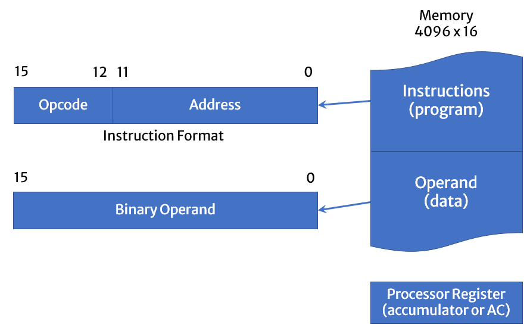
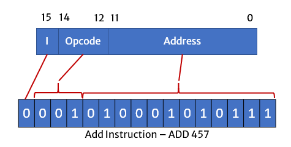
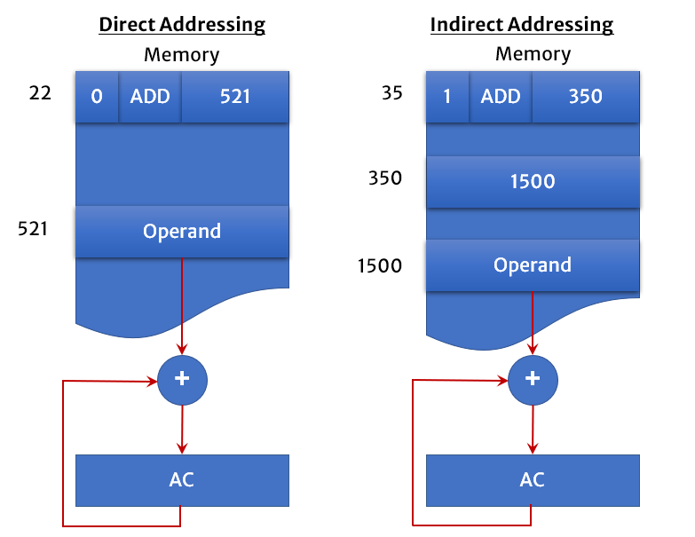
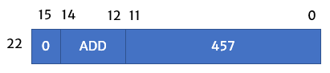
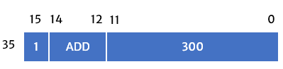
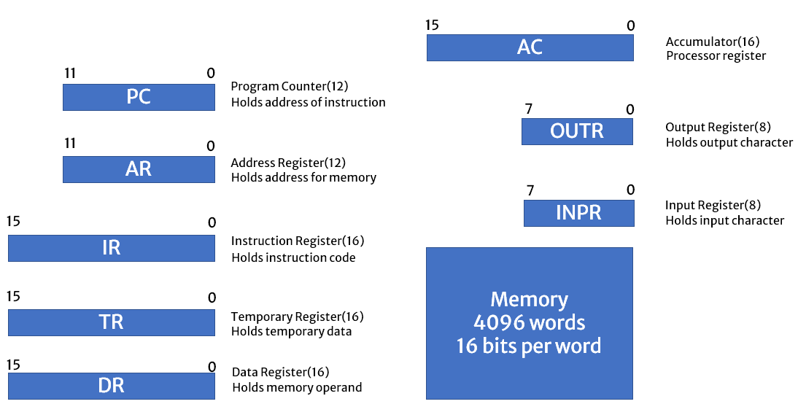
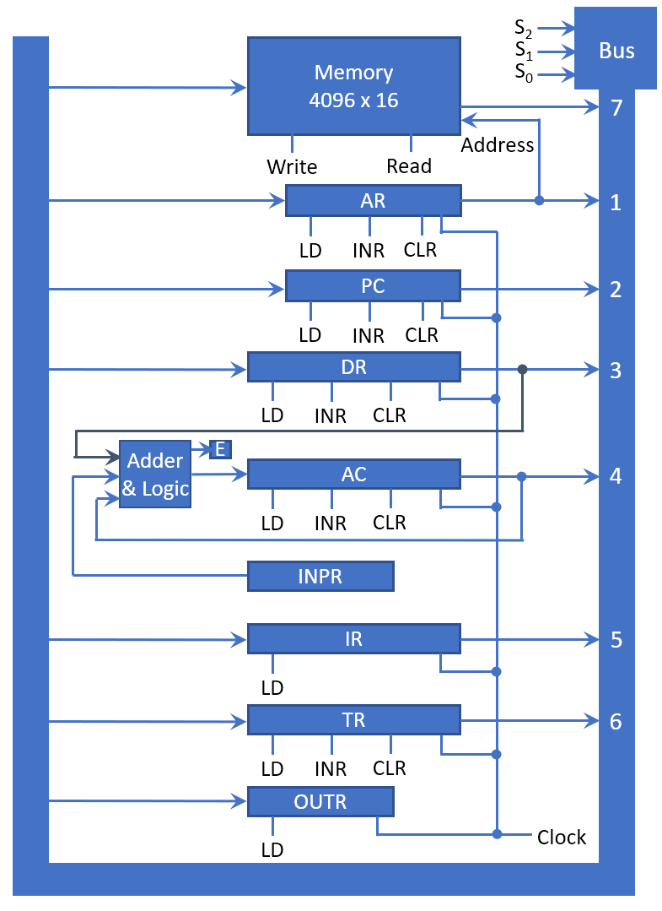

# Instruction Codes

**Program**

- A program is a set of instructions that specify the operations, operands and the sequence by which processing has to occur.

**Computer Instruction**

- A computer instruction is a binary code that specifies a sequence of micro-operations for the computer.
- The computer reads each instruction from memory and places it in a control register.
- The control then interprets the binary code of the instruction and proceeds to execute it by issuing a sequence of micro-operations.

**Instruction Code**

- An instruction code is a group of bits that instruct the computer to perform a specific operation.
- Example 

**Operation Code (OpCode)**

- The operation code of an instruction is a group of bits that define such operations as add, subtract, multiply, shift, and complement.
- The number of bits required for the operation code of an instruction depends on the total number of operations available in the computer.
- The operation code must consist of at least n bits for a given 2n (or less) distinct operations.

# Stored Program Organization

- The simplest way to organize a computer is to have one processor register(AC) and an instruction code format with two parts. 
  - The first part specifies the operation (opcode) to be performed and the second specifies an address (operand).
- The memory address tells the control where to find an operand in memory. 
- This operand is read from memory and used as the data to be operated on together with the data stored in the processor register.
- Instructions are stored in one section of memory and data in another.
- For a memory unit with 4096 words, we need 12 bits to specify an address since 2^12 = 4096.
- If we store each instruction code in one 16-bit memory word, we have available four bits for operation code (opcode) to specify one out of 16 possible operations, and 12 bits to specify the address of an operand. 
- The control reads a 16-bit instruction from the program portion of memory. 
- It then executes the operation specified by the operation code.

# Instruction format of Basic Computer

Instruction of basic computer can be divided into three parts.

- 1st part is known as OpCode which is further divided into two parts where first bit is is known as Mode or I Bit. I bit is used to indicate direct or indirect addressing.
- And other 3 bits are for OpCode. OpCode bits are used to indicate which operation needs to be performed. Each operation has unique OpCode.
- 2nd part is for Address Operand in case of direct addressing and address of another address in case of indirect addressing.

# Direct and Indirect Addressing of Memory

- If the second part of an instruction format specifies the address of an operand, the instruction is said to have a direct address.
- Direct Addressing is also known as immediate addressing or immediate operand.
- In Indirect address, the bits in the second part of the instruction designate an address of a memory word in which the address of the operand is found. 

## Example of Direct Addressing 

- A direct address instruction is placed at address 22 in memory. 
- The I bit is 0, so the instruction is recognized as a direct address instruction. 
- The opcode specifies an ADD instruction, and the address part is the binary equivalent of 457.
- The control finds the operand in memory at address 457 and adds it to the content of AC. 

# Example of Indirect Addressing

- The instruction in address 35 has a mode bit I = 1, recognized as an indirect address instruction. 
- The address part is the binary equivalent of 300. 
- The control goes to address 300 to find the address of the operand. 
- The address of the operand in this case is 1350. 
- The operand found in address 1350 is then added to the content of AC.

# Computer Instruction

- Computer instructions are a set of machine language instructions that a particular processor understands and executes. A computer performs tasks on the basis of the instruction provided.
- Computer Instructions contains
  - Mode / I bit
  - OpCode
  - Address
- A basic computer has three instruction code formats which are:
  - Memory - reference instruction
  - Register - reference instruction
  - Input - Output instruction

## Memory - reference instruction

- Here Opcode ranges from 000 to 110
- And I (Mode) bit is 0/1 depend on the type of addressing (direct/indirect)
- In Memory reference instruction, 12 bits of memory location is specified to address the location of memory

## Register - reference instruction

- Here Opcode is set to 111 and I (Mode) bit is set to 0
- A Register-reference instruction specifies an operation on the AC (Accumulator) register.

## Input - Output instruction

- Here Opcode is set to 111 and I (Mode) bit is set to 1
- Just like the Register-reference instruction, an Input-Output instruction does not need a reference to memory and is recognized by the operation code 111 with a 1 in the leftmost bit of the instruction. The remaining 12 bits are used to specify the type of the input-output operation or test performed.

> Note
>
> - The three operation code bits in positions 12 through 14 should be equal to 111. Otherwise, the instruction is a memory-reference type, and the bit in position 15 is taken as the addressing mode I.
> - When the three operation code bits are equal to 111, control unit inspects the bit in position 15. If the bit is 0, the instruction is a register-reference type. Otherwise, the instruction is an input-output type having bit 1 at position 15.

# Instruction Set Completeness

- A set of instructions is said to be complete if the computer includes a sufficient number of instructions in each of the following categories:

- **Arithmetic, logical and shift instructions**

  - Arithmetic, logic and shift instructions provide computational capabilities for processing the type of data the user may wish to perform.

- **A set of instructions for moving information to and from memory and processor registers.** 

  - A huge amount of binary information is stored in the memory unit, but all computations are done in processor registers. Therefore, one must possess the capability of moving information between these two units.

- **Instructions which controls the program together with instructions that check status conditions.** 

  - Program control instructions such as branch instructions are used change the sequence in which the program is executed.

- **Input and Output instructions**

  - Input and Output instructions act as an interface between the computer and the user. Programs and data must be transferred into memory, and the results of computations must be transferred back to the user.

# Computer Registers

# Common Bus System of Computer

