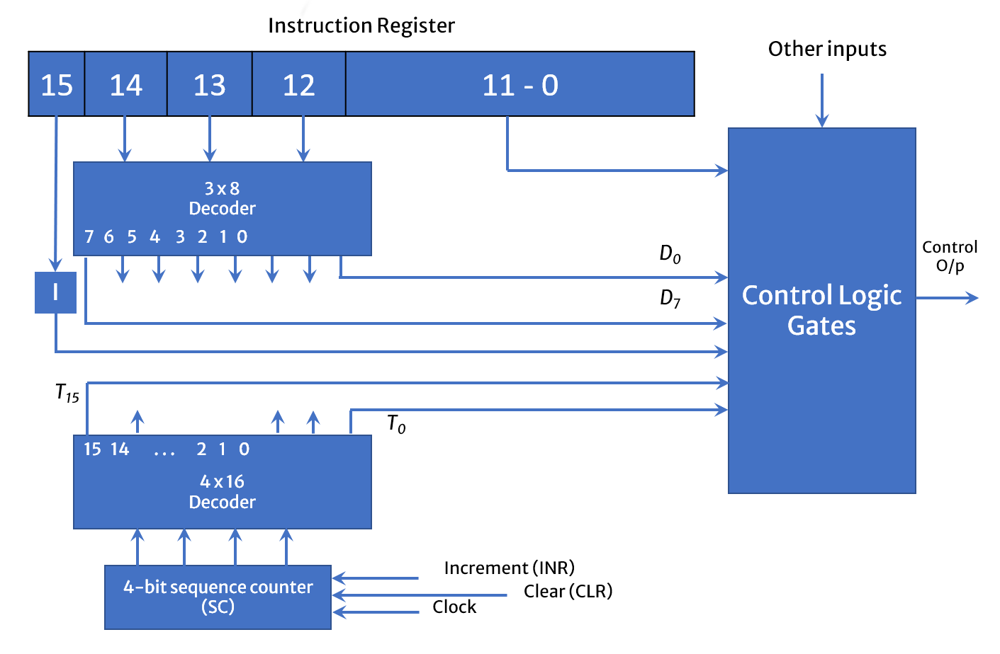
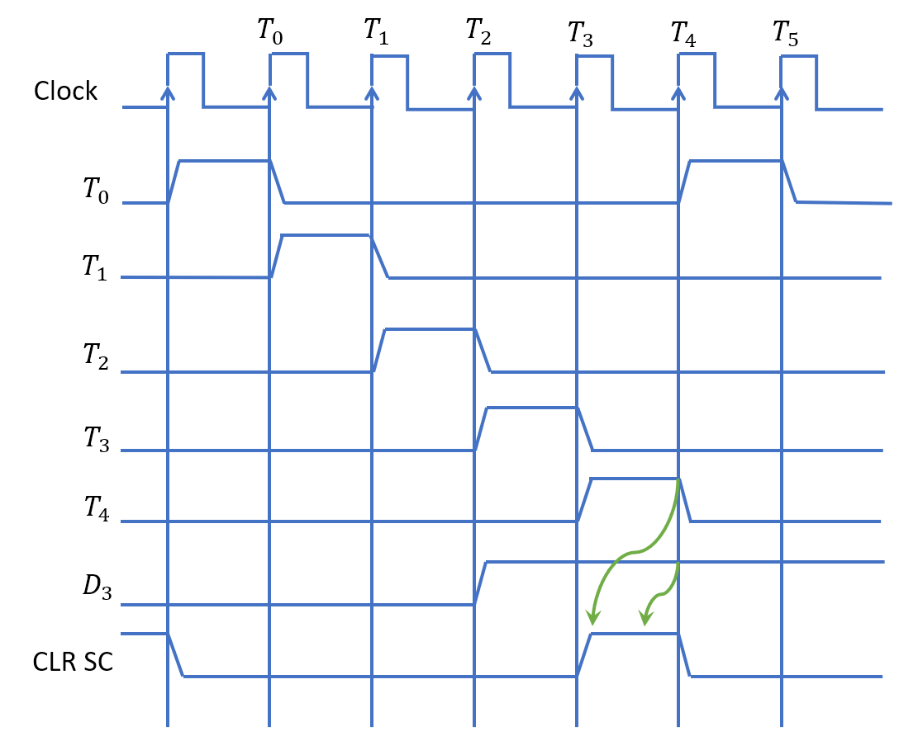

# Table of contents

- [Instruction Codes](#instruction-codes)
- [Stored Program Organization](#stored-program-organization)
- [Instruction format of Basic Computer](#instruction-format-of-basic-computer)
- [Direct and Indirect Addressing of Memory](#direct-and-indirect-addressing-of-memory)
  - [Example of Direct Addressing](#example-of-direct-addressing)
- [Example of Indirect Addressing](#example-of-indirect-addressing)
- [Computer Instruction](#computer-instruction)
  - [Memory - reference instruction](#memory---reference-instruction)
  - [Register - reference instruction](#register---reference-instruction)
  - [Input - Output instruction](#input---output-instruction)
- [Basic Set of Instructions](#basic-set-of-instructions)
  - [Memory Reference Instructions](#memory-reference-instructions)
  - [Register Reference Instructions](#register-reference-instructions)
  - [IO Reference Instructions](#io-reference-instructions)
- [Instruction Set Completeness](#instruction-set-completeness)
- [Computer Registers](#computer-registers)
- [Common Bus System of Computer](#common-bus-system-of-computer)
- [Control Organization](#control-organization)
- [Control Unit of Basic Computer](#control-unit-of-basic-computer)
- [Example of Timing and Control](#example-of-timing-and-control)

# Instruction Codes

**Program**

- A program is a set of instructions that specify the operations, operands and the sequence by which processing has to occur.

**Computer Instruction**

- A computer instruction is a binary code that specifies a sequence of micro-operations for the computer.
- The computer reads each instruction from memory and places it in a control register.
- The control then interprets the binary code of the instruction and proceeds to execute it by issuing a sequence of micro-operations.

**Instruction Code**

- An instruction code is a group of bits that instruct the computer to perform a specific operation.
- Example 

**Operation Code (OpCode)**

- The operation code of an instruction is a group of bits that define such operations as add, subtract, multiply, shift, and complement.
- The number of bits required for the operation code of an instruction depends on the total number of operations available in the computer.
- The operation code must consist of at least n bits for a given 2n (or less) distinct operations.

# Stored Program Organization

- The simplest way to organize a computer is to have one processor register(AC) and an instruction code format with two parts. 
  - The first part specifies the operation (opcode) to be performed and the second specifies an address (operand).
- The memory address tells the control where to find an operand in memory. 
- This operand is read from memory and used as the data to be operated on together with the data stored in the processor register.
- Instructions are stored in one section of memory and data in another.
- For a memory unit with 4096 words, we need 12 bits to specify an address since 2^12 = 4096.
- If we store each instruction code in one 16-bit memory word, we have available four bits for operation code (opcode) to specify one out of 16 possible operations, and 12 bits to specify the address of an operand. 
- The control reads a 16-bit instruction from the program portion of memory. 
- It then executes the operation specified by the operation code.

# Instruction format of Basic Computer

Instruction of basic computer can be divided into three parts.

- 1st part is known as OpCode which is further divided into two parts where first bit is is known as Mode or I Bit. I bit is used to indicate direct or indirect addressing.
- And other 3 bits are for OpCode. OpCode bits are used to indicate which operation needs to be performed. Each operation has unique OpCode.
- 2nd part is for Address Operand in case of direct addressing and address of another address in case of indirect addressing.

# Direct and Indirect Addressing of Memory

- If the second part of an instruction format specifies the address of an operand, the instruction is said to have a direct address.
- Direct Addressing is also known as immediate addressing or immediate operand.
- In Indirect address, the bits in the second part of the instruction designate an address of a memory word in which the address of the operand is found. 

## Example of Direct Addressing 

- A direct address instruction is placed at address 22 in memory. 
- The I bit is 0, so the instruction is recognized as a direct address instruction. 
- The opcode specifies an ADD instruction, and the address part is the binary equivalent of 457.
- The control finds the operand in memory at address 457 and adds it to the content of AC. 

# Example of Indirect Addressing

- The instruction in address 35 has a mode bit I = 1, recognized as an indirect address instruction. 
- The address part is the binary equivalent of 300. 
- The control goes to address 300 to find the address of the operand. 
- The address of the operand in this case is 1350. 
- The operand found in address 1350 is then added to the content of AC.

# Computer Instruction

- Computer instructions are a set of machine language instructions that a particular processor understands and executes. A computer performs tasks on the basis of the instruction provided.
- Computer Instructions contains
  - Mode / I bit
  - OpCode
  - Address
- A basic computer has three instruction code formats which are:
  - Memory - reference instruction
  - Register - reference instruction
  - Input - Output instruction

## Memory - reference instruction

- Here Opcode ranges from 000 to 110
- And I (Mode) bit is 0/1 depend on the type of addressing (direct/indirect)
- In Memory reference instruction, 12 bits of memory location is specified to address the location of memory

## Register - reference instruction

- Here Opcode is set to 111 and I (Mode) bit is set to 0
- A Register-reference instruction specifies an operation on the AC (Accumulator) register.

## Input - Output instruction

- Here Opcode is set to 111 and I (Mode) bit is set to 1
- Just like the Register-reference instruction, an Input-Output instruction does not need a reference to memory and is recognized by the operation code 111 with a 1 in the leftmost bit of the instruction. The remaining 12 bits are used to specify the type of the input-output operation or test performed.

> Note
>
> - The three operation code bits in positions 12 through 14 should be equal to 111. Otherwise, the instruction is a memory-reference type, and the bit in position 15 is taken as the addressing mode I.
> - When the three operation code bits are equal to 111, control unit inspects the bit in position 15. If the bit is 0, the instruction is a register-reference type. Otherwise, the instruction is an input-output type having bit 1 at position 15.

# Basic Set of Instructions

## Memory Reference Instructions

- Instructions references memory address
- I Bit is 0 / 1 Depending on direct or indirect addressing
- Opcode ranges form 000 to 110

| **Symbol** | **Hexadecimal Code** | **Description** |                                |
| ---------- | -------------------- | --------------- | ------------------------------ |
| AND        | 0xxx                 | 8xxx            | And memory word to AC          |
| ADD        | 1xxx                 | 9xxx            | Add memory word to AC          |
| LDA        | 2xxx                 | Axxx            | Load memory word to AC         |
| STA        | 3xxx                 | Bxxx            | Store AC content in memory     |
| BUN        | 4xxx                 | Cxxx            | Branch Unconditionally         |
| BSA        | 5xxx                 | Dxxx            | Branch and Save Return Address |
| ISZ        | 6xxx                 | Exxx            | Increment and skip if 0        |

## Register Reference Instructions

- Instructions performed on register (Generally AC)
- I Bit is 0, and OpCode is set to 111.
- Bit 0 to 11 represents the operation

| **Symbol** | **Hexadecimal Code** | **Description**                 |
| ---------- | -------------------- | ------------------------------- |
| CLA        | 7800                 | Clear AC                        |
| CLE        | 7400                 | Clear E(overflow bit)           |
| CMA        | 7200                 | Complement AC                   |
| CME        | 7100                 | Complement E                    |
| CIR        | 7080                 | Circulate right AC and E        |
| CIL        | 7040                 | Circulate left AC and E         |
| INC        | 7020                 | Increment AC                    |
| SPA        | 7010                 | Skip next instruction if AC > 0 |
| SNA        | 7008                 | Skip next instruction if AC < 0 |
| SZA        | 7004                 | Skip next instruction if AC = 0 |
| SZE        | 7002                 | Skip next instruction if E = 0  |
| HLT        | 7001                 | Halt computer                   |

## IO Reference Instructions

- Instructions performed on Input Output information
- I Bit is 1, and OpCode is set to 111.
- Bit 0 to 11 represents the operation

| **Symbol** | **Hexadecimal Code** | **Description**          |
| ---------- | -------------------- | ------------------------ |
| INP        | F800                 | Input character to AC    |
| OUT        | F400                 | Output character from AC |
| SKI        | F200                 | Skip on input flag       |
| SKO        | F100                 | Skip on output flag      |
| ION        | F080                 | Interrupt On             |
| IOF        | F040                 | Interrupt Off            |

# Instruction Set Completeness

- A set of instructions is said to be complete if the computer includes a sufficient number of instructions in each of the following categories:

- **Arithmetic, logical and shift instructions**

  - Arithmetic, logic and shift instructions provide computational capabilities for processing the type of data the user may wish to perform.

- **A set of instructions for moving information to and from memory and processor registers.** 

  - A huge amount of binary information is stored in the memory unit, but all computations are done in processor registers. Therefore, one must possess the capability of moving information between these two units.

- **Instructions which controls the program together with instructions that check status conditions.** 

  - Program control instructions such as branch instructions are used change the sequence in which the program is executed.

- **Input and Output instructions**

  - Input and Output instructions act as an interface between the computer and the user. Programs and data must be transferred into memory, and the results of computations must be transferred back to the user.

# Computer Registers

| Register             | Symbol | Number of bits | Function                         |
| -------------------- | ------ | -------------- | -------------------------------- |
| Data register        | DR     | 16             | Holds memory operand             |
| Address register     | AR     | 12             | Holds address for the memory     |
| Accumulator          | AC     | 16             | Processor register               |
| Instruction register | IR     | 16             | Holds instruction code           |
| Program counter      | PC     | 12             | Holds address of the instruction |
| Temporary register   | TR     | 16             | Holds temporary data             |
| Input register       | INPR   | 8              | Carries input character          |
| Output register      | OUTR   | 8              | Carries output character         |

> Visual representation of registers and its size

# Common Bus System of Computer

# Control Organization

- **Hardwired Control**
  - The control logic is implemented with gates, flips-flops, decoders and other digital circuits.
  - It can be optimized to produce a fast mode of operation.
  - It requires changes in the wiring among the various components if the design has to be modified or changed.
- **Microprogrammed Control**
  - The control information is stored in a control memory.
  - The control memory is programmed to initiate the required sequence of micro-operations.
  - Any required changes or modifications can be done by updating the microprogram in control memory.

# Control Unit of Basic Computer

- An instruction read from memory is placed in the instruction register (IR).
- In control unit the IR is divided into three parts: I bit, the operation code (12-14)bit, and bits 0 through 11.
- The operation code in bits 12 through 14 are decoded with a 3 x 8 decoder.
- Bit-15 of the instruction is transferred to a flip-flop designated by the symbol I.
- The eight outputs of the decoder are designated by the symbols D0 through D7. 
- Bits 0 through 11 are applied to the control logic gates.
- The 4‐bit sequence counter can count in binary from 0 through 15. The outputs of counter are decoded into 16 timing signals T0 through T15.
- The sequence counter SC can be incremented or cleared synchronously.
- Most of the time, the counter is incremented to provide the sequence of timing signals out of 4 X 16 decoder.
- Once in awhile, the counter is cleared to 0, causing the next timing signal to be T0.

# Example of Timing and Control

- As an example, consider the case where SC is incremented to provide timing signals T0, T1, T2, T3 and T4 in sequence. At time T4, SC is cleared to 0 if decoder output D3 is active. This is expressed symbolically by the statement 
- **D3T4:  SC ← 0**
- Initially, the CLR input of SC is active.
- The first positive transition of the clock clears SC to 0, which in turn activates the timing T0 out of the decoder.
- T0 is active during one clock cycle.
- The positive clock transition labeled T0 in the diagram will trigger only those registers whose control inputs are connected to timing signal T0.

