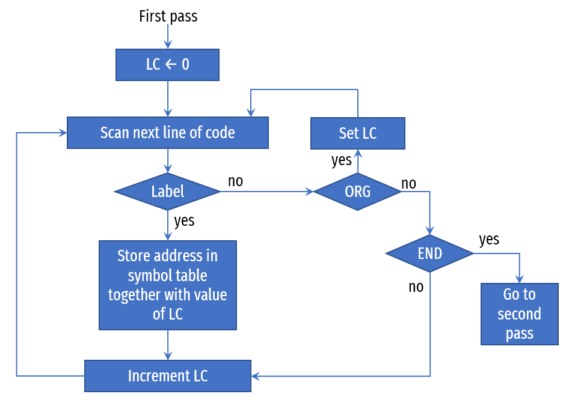

# Table of contents

- [What is Program?](#what-is-program)
- [Categories of Program](#categories-of-program)
  - [Binary Code](#binary-code)
  - [Octal or hexadecimal code](#octal-or-hexadecimal-code)
  - [Symbolic code](#symbolic-code)
  - [High Level Programming Language](#high-level-programming-language)
- [Assembler](#assembler)
- [Example of Assembly Program](#example-of-assembly-program)
- [First Pass of an assembler](#first-pass-of-an-assembler)
- [Second Pass of an assembler](#second-pass-of-an-assembler)
- [Assembly program to add two numbers](#assembly-program-to-add-two-numbers)
- [Assembly program to subtract two numbers](#assembly-program-to-subtract-two-numbers)
- [Assembly program to input a character](#assembly-program-to-input-a-character)
- [Assembly program to output a character](#assembly-program-to-output-a-character)
- [Assembly program to demonstrate subroutine](#assembly-program-to-demonstrate-subroutine)

# What is Program?

Program is list of instructions or statements for directing the computer to perform a required task.

# Categories of Program

Program can be written in many different ways.

- Binary Code
- Octal / Hexadecimal Code
- Symbolic Code
- High Level Programming Language Code

## Binary Code

- This is a sequence of instructions and operands in binary that list the exact representation of instructions as they appear in computer memory.

**Example**

```assembly
Location   	Instruction Code  
0000 		0010 0000 0000 0100  
0001 		0001 0000 0000 0101  
0010      	0011 0000 0000 0110  
0011      	0111 0000 0000 0001  
0100     	0000 0000 0101 0011  
0101     	1111 1111 1110 1001  
0110     	0000 0000 0000 0000  
```

## Octal or hexadecimal code

- As its very lengthy, time consuming and very difficult to under stand binary code for human. We can translate our code into octal or hexadecimal code.
- This is an equivalent translation of the binary code to octal or hexadecimal representation. 

```assembly
Location  	Instruction Code in Hexadecimal
000 		2004
001 		1005
002 		3006
003 		7001
004 		0053
005 		FFE9
006 		0000
```


## Symbolic code

- The user uses symbols (letters, numerals, or special characters) for the operation part, the address part, and other parts of the instruction code.
- Each symbolic instruction can be translated into one binary coded instruction by a special program called an assembler and language is referred to as an assembly language program.

```assembly
Location 	Instruction		Comment     
000			LDA 004 		/Load first operand  into AC 
001			ADD 005 		/Add second operand  to AC   
002			STA 006 		/Store sum in  location 006  
003			HLT  			/Halt  computer     
004			0053 			/First operand      
005			FFE9 			/Second  operand (negative)  
006			0000 			/Store sum here     
```


## High Level Programming Language

- These are special languages developed to reflect the procedures used in the solution of a problem rather than be concerned with the computer hardware behavior. E.g. Fortran, C++, Java, etc.

```c
{
int a, b;
a = 10;
b = 20;
c = a + b;
}
```

# Assembler

- An assembler is a program that accepts a symbolic language program and produces its binary machine language equivalent. 
- The input symbolic program is called the source program and the resulting binary program is called the object program. 

- Assembler contains two types of instructions.

1. **Pseudo Instruction**
   - A pseudo instruction is not a machine instruction but rather an instruction to the assembler giving information about some phase of the translation.
   - Below are the list of pseudo instructions.

| **Symbol** | **Information** **for the Assembler**                        |
| ---------- | ------------------------------------------------------------ |
| ORG N      | Hexadecimal  number N is the memory location for the instruction or operand listed in the  following line. |
| END        | Denotes the end of symbolic program.                         |
| DEC N      | Signed decimal  number N to be converted to binary.          |
| HEX N      | Hexadecimal  number N to be converted to binary              |

1. **Actual Machine Instruction**
   - Instruction which is actually executed by the computer. Actual machine instruction includes memory reference instruction, register reference instruction and input output instructions.

# Example of Assembly Program


In assembly code instead of using numeric location, we generally use alphanumeric symbols to represent locations. This is managed by storing the symbol name along with its corresponding location in a table by assembler. This table is known as a **symbol table**.

# First Pass of an assembler



# Second Pass of an assembler


# Assembly program to add two numbers

```assembly
		ORG 0		/Origin of program is location 0
		LDA A		/Load operand from location A
		ADD B		/Add Operand from location B
		STA C		/Store sum in location C
		HLT			/Halt computer
A,		DEC 83		/Decimal Operand
B, 		DEC 22		/Decimal Operand
C,		DEC 0		/Decimal Operand, Sum is stored here
		END			/End of symbolic program
```

# Assembly program to subtract two numbers

```assembly
		ORG 100		/Origin of program is location 100
        LDA SUB		/Load subtrahend to AC
        CMA			/Complement AC
        INC			/Increment AC
        ADD MIN		/Add minuend to AC
        STA DIF		/Store difference to location DIF
        HLT			/Halt computer        
MIN, 	DEC 83		/Decimal Operand
SUB, 	DEC 20		/Decimal Operand
DIF, 	HEX 0		/Hexadecimal Operand, Difference is stored here
		END			/End of symbolic program
```

# Assembly program to input a character

```assembly
		ORG 100		/Origin of program is location 100
CIF, 	SKI			/Check input flag (skip next instruction if flag is 1)
		BUN CIF		/Flag = 0, branch to check again
		INP			/Flag = 1, input character from INPR to AC
		OUT			/Print character, output character from AC to OUTR
		STA CHR		/Store character to location CHR
		HLT			/Halt computer
CHR,	DEC 0		/Decimal operand, Character is stored here
		END			/End of symbolic code
```

# Assembly program to output a character

```assembly
		ORG 100		/Origin of program is location 100
		LDA CHR		/Load character into AC
COF,	SKO			/Check output flag (skip next instruction if flag is 1)
		BUN COF		/Flag = 0, branch to check again
		OUT			/Flag = 1, output character from AC to OUTR
		HLT			/Halt computer
CHR,	HEX 0057	/Hexadecimal Operand (Character is W)
		END			/End of symbolic code
```


# Assembly program to demonstrate subroutine

```assembly
					ORG 100		/Main program, origin of program location is 100
100					LDA X		/Load X to AC
101					BSA SH4		/Brnach to subroutine, Branch and save return address
102					STA X		/Store shifted number to location X
103					LDA Y		/Load Y to AC
104					BSA SH4		/Branch to subroutine, Branch and save return address
105					STA Y		/Store shifted number to location Y
106					HLT			/Halt Computer
107		X,			HEX 1234	/Hexadecimal Operand
108		Y,			HEX 4321	/Hexadecimal Operand
								/Subroutine to shift left 4 times
109		SH4			HEX 0		/Store return address here
10A					CIL			/Circulate left once
10B					CIL			/Circulate left once
10C					CIL			/Circulate left once
10D					CIL			/Circulate left once
10E					AND MSK		/Set AC(13-16) to zero
10F					BUN SH4 I	/Return to main program using indirect addressing
110		MSK,		HEX FFF0	/Mask operand
					END			/End of symbolic code
```

