# Table of contents

- [Stack Organization](#stack-organization)
  - [Register Stack](#register-stack)
  - [Memory Stack](#memory-stack)
- [Reverse Polish Notation](#reverse-polish-notation)
  - [Evaluation of Arithmetic Expression](#evaluation-of-arithmetic-expression)
- [General Register based CPU Organization](#general-register-based-cpu-organization)
  - [Advantages of General register based CPU organization](#advantages-of-general-register-based-cpu-organization)
  - [Disadvantages of General register based CPU organization](#disadvantages-of-general-register-based-cpu-organization)
- [Instruction Format](#instruction-format)
  - [Three Address Instructions](#three-address-instructions)
  - [Two Address Instructions](#two-address-instructions)
  - [One Address Instruction](#one-address-instruction)
  - [Zero Address Instruction](#zero-address-instruction)
  - [RISC Instruction](#risc-instruction)
- [Addressing Modes](#addressing-modes)
  - [Implied Mode](#implied-mode)
  - [Immediate Mode](#immediate-mode)
  - [Register Mode](#register-mode)
  - [Register Indirect Mode](#register-indirect-mode)
  - [Auto increment or Auto decrement Mode](#auto-increment-or-auto-decrement-mode)
  - [Direct Address Mode](#direct-address-mode)
  - [Indirect Address Mode](#indirect-address-mode)
  - [Relative Address Mode](#relative-address-mode)
  - [Indexed Addressing Mode](#indexed-addressing-mode)
  - [Base Register Addressing Mode](#base-register-addressing-mode)
- [Data transfer and manipulation Instructions](#data-transfer-and-manipulation-instructions)
  - [Data Transfer Instructions](#data-transfer-instructions)
  - [Data Manipulation Instructions](#data-manipulation-instructions)
- [Program Control](#program-control)
  - [Status bit Condition](#status-bit-condition)
  - [Branch instructions dependent on status bit value.](#branch-instructions-dependent-on-status-bit-value)
  - [Unsigned compare conditions](#unsigned-compare-conditions)
  - [Signed compare conditions](#signed-compare-conditions)
- [Program Interrupt](#program-interrupt)
  - [External Interrupt](#external-interrupt)
  - [Internal interrupts (Traps)](#internal-interrupts-traps)
  - [Software interrupts](#software-interrupts)
- [RISC & CISC](#risc--cisc)
  - [RISC and CISC Comparison](#risc-and-cisc-comparison)
- [Parallel Processing and Pipelining](#parallel-processing-and-pipelining)
  - [Instruction Pipeline](#instruction-pipeline)

# Stack Organization
-  A stack is a storage device that stores information in such a manner that the item stored last is the first item retrieved (LIFO).
-  The register that holds the address for the stack is called a stack pointer (SP) because its value always points at the top item in the stack. 
-  The physical registers of a stack are always available for reading or writing. It is the content of the word that is inserted or deleted.
-  There are two types of stack organization
	- Register stack – built using registers
	- Memory stack – logical part of memory allocated as stack
## Register Stack
-  A stack can be placed in a portion of a large memory or it can be organized as a collection of a finite number of memory words or registers. Figure shows the organization of a 64-word register stack. 
-  The stack pointer register SP contains a binary number whose value is equal to the address of the word that is currently on top of the stack.
-  In a 64-word stack, the stack pointer contains 6 bits because 26 = 64. 
-  Since SP has only six bits, it cannot exceed a number greater than 63 (111111 in binary).
-  The one-bit register FULL is set to 1 when the stack is full, and the one-bit register EMTY is set to 1 when the stack is empty of items. 
-  DR is the data register that holds the binary data to be written into or read out of the stack.

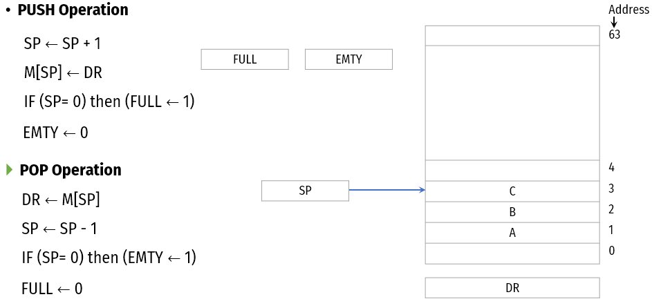

## Memory Stack
-  The implementation of a stack in the CPU is done by assigning a portion of memory to a stack operation and using a processor register as a stack pointer. 
-  Figure shows a portion of computer memory partitioned into three segments: program, data, and stack. 
-  The program counter PC points at the address of the next instruction in the program which is used during the fetch phase to read an instruction.
-  The address registers AR points at an array of data which is used during the execute phase to read an operand.
-  The stack pointer SP points at the top of the stack which is used to push or pop items into or from the stack.
-  We assume that the items in the stack communicate with a data register DR. 

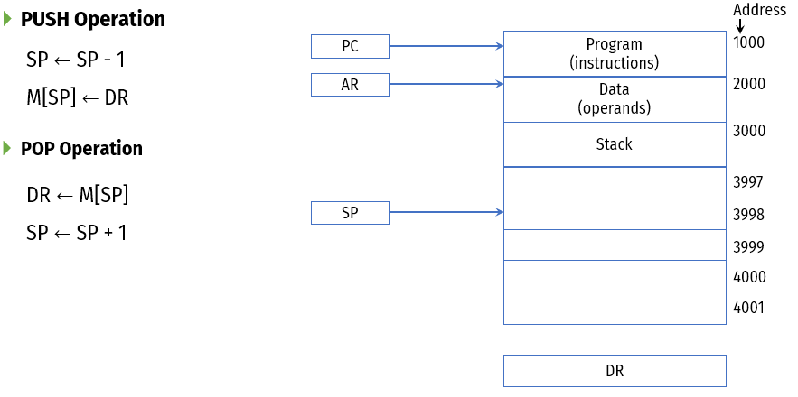

# Reverse Polish Notation

-  The common mathematical method of writing arithmetic expressions imposes difficulties when evaluated by a computer.
-  The Polish mathematician Lukasiewicz showed that arithmetic expressions can be represented in prefix notation as well as postfix notation.

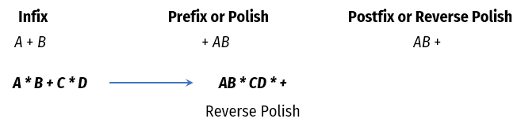

## Evaluation of Arithmetic Expression

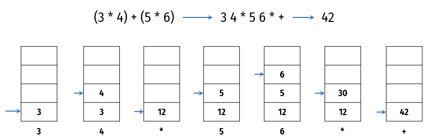

# General Register based CPU Organization
-  When we are using multiple general-purpose registers, instead of a single accumulator register, in the CPU Organization then this type of organization is known as General register-based CPU Organization. 
-  In this type of organization, the computer uses two or three address fields in their instruction format. Each address field may specify a general register or a memory word. 
-  If many CPU registers are available for heavily used variables and intermediate results, we can avoid memory references much of the time, thus vastly increasing program execution speed, and reducing program size. 

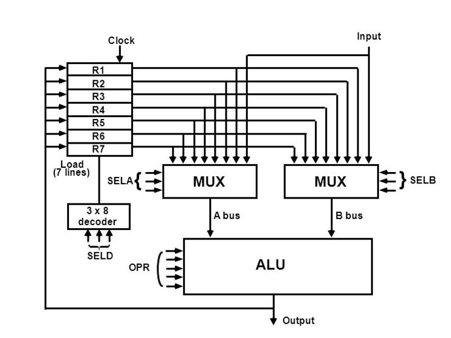

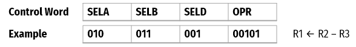

-  The CPU bus system is managed by the control unit. The control unit explicit the data flow through the ALU by choosing the function of the ALU and components of the system.
-  Consider R1 ← R2 + R3, the following are the functions implemented within the CPU
-  MUX A Selector (SELA) − It can place R2 into bus A.
-  MUX B Selector (SELB) − It can place R3 into bus B.
-  ALU Operation Selector (OPR) − It can select the arithmetic addition (ADD).
-  Decoder Destination Selector (SELD) − It can transfers the result into R1.

| **Binary Code** | **SELA** | **SELB** | **SELD** |
| --------------- | -------- | -------- | -------- |
| **000**         | Input    | Input    | None     |
| **001**         | R1       | R1       | R1       |
| **010**         | R2       | R2       | R2       |
| **011**         | R3       | R3       | R3       |
| **100**         | R4       | R4       | R4       |
| **101**         | R5       | R5       | R5       |
| **110**         | R6       | R6       | R6       |
| **111**         | R7       | R7       | R7       |

| **OPR Select** | **Operation**  | **Symbol** |
| -------------- | -------------- | ---------- |
| **00000**      | Transfer A     | TSFA       |
| **00001**      | Increment A    | INCA       |
| **00010**      | Add A + B      | ADD        |
| **00101**      | Subtract A - B | SUB        |
| **00110**      | Decrement A    | DECA       |
| **01000**      | ADD A and B    | AND        |
| **01010**      | OR A and B     | OR         |
| **01100**      | XOR A and B    | XOR        |
| **01110**      | Complement A   | COMA       |
| **10000**      | Shift right A  | SHRA       |
| **11000**      | Shift left A   | SHLA       |

## Advantages of General register based CPU organization

-  Efficiency of CPU increases as there are a large number of registers are used in this organization.
-  Less memory space is used to store the program since the instructions are written in a compact way. 
-  The disadvantages of General register based CPU organization
-  Care should be taken to avoid unnecessary usage of registers. Thus, compilers need to be more intelligent in this aspect.
-  Since a large number of registers are used, thus extra cost is required in this organization. 

## Disadvantages of General register based CPU organization

- Care should be taken to avoid unnecessary usage of registers. Thus, compilers need to be more intelligent in this aspect.
- Since a large number of registers are used, thus extra cost is required in this organization

# Instruction Format
-  Instructions are categorized into different formats with respect to the operand fields in the instructions.
-  Three Address Instructions
-  Two Address Instruction
-  One Address Instruction
-  Zero Address Instruction
-  RISC Instructions
## Three Address Instructions
-  Computers with three-address instruction formats can use each address field to specify either a processor register or a memory operand.
-  The program in assembly language that evaluates X = (A + B) * (C + D) is shown below.

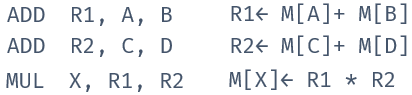

-  The advantage of three-address format is that it results in short programs when evaluating arithmetic expressions.
-  The disadvantage is that the binary-coded instructions require too many bits to specify three addresses.

## Two Address Instructions
-  Two address instructions are the most common in commercial computers. Here again each address field can specify either a processor register or a memory word. 
-  The program to evaluate X = (A + B) * (C + D) is as follows:

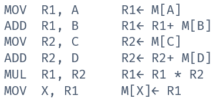

## One Address Instruction
-  One address instructions use an implied accumulator (AC) register for all data manipulation.
-  For multiplication and division these is a need for a second register.
-  However, here we will neglect the second register and assume that the AC contains the result of all operations. 
-  The program to evaluate X = (A + B) * (C + D) is

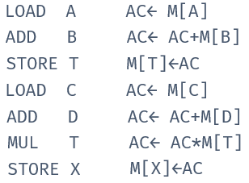

## Zero Address Instruction
-  A stack-organized computer does not use an address field for the instructions ADD and MUL.
-  The PUSH and POP instructions, however, need an address field to specify the operand that communicates with the stack. 
-  The program to evaluate X = (A + B) * (C + D) will be written for a stack-organized computer.
-  To evaluate arithmetic expressions in a stack computer, it is necessary to convert the expression into reverse polish notation.
-  The program to evaluate X = (A + B) * (C + D)

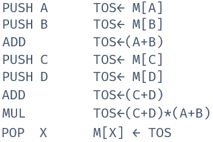

## RISC Instruction
-  The instruction set of a typical RISC processor is restricted to the use of load and store instructions when communicating between memory and CPU.
-  All other instructions are executed within the registers of the CPU without referring to memory.
-  A program for a RISC type CPU consists of LOAD and STORE instructions that have one memory and one register address, and computational-type instructions that have three addresses with all three specifying processor registers.
-  The following is a program to evaluate X = (A + B) * (C + D)

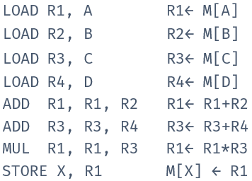

# Addressing Modes
- The addressing mode specifies a rule for interpreting or modifying the address field of the instruction before the operand is actually referenced.
- Computers use addressing mode techniques for the purpose of accommodating one or both of the following provisions:

- To give programming versatility to the user by providing such facilities as pointers to memory, counters for loop control, indexing of data, and program relocation.
  -  To reduce the number of bits in the addressing field of the instruction.
- There are basic 10 addressing modes supported by the computer.
    - Implied Mode
    - Immediate Mode
    - Register Mode
    - Register Indirect Mode
    - Autoincrement or Autodecrement Mode
    - Direct Address Mode
    - Indirect Address Mode
    - Relative Address Mode
    - Indexed Addressing Mode
    - Base Register Addressing Mode

## Implied Mode
-  Operands are specified implicitly in the definition of the instruction. 
-  For example, the instruction “complement accumulator (CMA)” is an implied-mode instruction because the operand in the accumulator register is implied in the definition of the instruction.
-  In fact, all register reference instructions that use an accumulator and zero address instructions are implied mode instructions.
## Immediate Mode
-  Operand is specified in the instruction itself. 
-  In other words, an immediate-mode instruction has an operand field rather than an address field.
-  The operand field contains the actual operand to be used in conjunction with the operation specified in the instruction.
-  Immediate mode of instructions is useful for initializing register to constant value.
-  E.g. MOV R1, 05H
   -  Instruction copies immediate number 05H to R1 register.
## Register Mode
-  Operands are in registers that reside within the CPU.
-  The particular register is selected from a register field in the instruction. 
-  E.g. MOV AX, BX
   -  Move value from BX to AX register
## Register Indirect Mode
-  In this mode the instruction specifies a register in the CPU whose contents give the address of the operand in memory.
-  Before using a register indirect mode instruction, the programmer must ensure that the memory address of the operand is placed in the processor register with a previous instruction.
-  E.g. MOV [R1], R2
   -  Value of R2 is moved to the memory location specified in R1.
## Auto increment or Auto decrement Mode
-  This is similar to the register indirect mode expect that the register is incremented or decremented after (or before) its value is used to access memory.
-  When the address stored in the register refers to a table of data in memory, it is necessary to increment or decrement the register after every access to the table. This can be achieved by using the increment or decrement instruction.
-  Effective address of the operand is the contents of a register specified in the instruction. After accessing the operand, the contents of this register are automatically incremented to point to the next consecutive memory location.
-  E.g. Add R1, (R2)+
## Direct Address Mode
-  Also known as absolute addressing mode.
-  In this mode the effective address is equal to the address part of the instruction.
-  The operand resides in memory and its address is given directly by the address field of the instruction.
> **E.g. ADD 457**

> **Value located at memory location 457 is added to AC**

## Indirect Address Mode
-  In this mode the address field of the instruction gives the address where the effective address is stored in memory.
-  Control fetches the instruction from memory and uses its address part to access memory again to read the effective address.
-  Based on the availability of Effective address, Indirect mode is of two kind:
-  Register Indirect: In this mode effective address is in the register, and corresponding register will be maintained in the address field of an instruction. 
-  Memory Indirect: In this mode effective address is in the memory, and corresponding memory address will be maintained in the address field of an instruction.
## Relative Address Mode
- In this mode the content of the program counter is added to the address part of the instruction in order to obtain the effective address.

- The address part of the instruction is usually a signed number which can be either positive or negative.

> **Effective address = address part of instruction + content of PC**

## Indexed Addressing Mode
- In this mode the content of an index register is added to the address part of the instruction to obtain the effective address.

- The indexed register is a special CPU register that contain an index value.

- The address field of the instruction defines the beginning address of a data array in memory.

- Each operand in the array is stored in memory relative to the begging address.

> **Effective address = address part of instruction + content of index register**
## Base Register Addressing Mode
-  In this mode the content of a base register is added to the address part of the instruction to obtain the effective address.
-  A base register is assumed to hold a base address and the address field of the instruction gives a displacement relative to this base address.

> **Effective address = address part of instruction + content of base register**

# Data transfer and manipulation Instructions

## Data Transfer Instructions

- Data transfer instructions move data from one place in the computer to another without changing the data content. 
- The most common transfers are between memory and processor registers, between processor registers and input or output, and between the processor registers themselves.

| **Name** | **Mnemonic** |
| -------- | ------------ |
| Load     | LD           |
| Store    | ST           |
| Move     | MOV          |
| Exchange | XCH          |
| Input    | IN           |
| Output   | OUT          |
| Push     | PUSH         |
| Pop      | POP          |

## Data Manipulation Instructions

- The data manipulation instructions in a typical computer are usually divided into three basic types:
  - Arithmetic instructions
  - Logical and bit manipulation instructions
  - Shift instructions

### Arithmetic Instructions

| **Name**                | **Mnemonic** |
| ----------------------- | ------------ |
| Increment               | INC          |
| Decrement               | DEC          |
| Add                     | ADD          |
| Subtract                | SUB          |
| Multiply                | MUL          |
| Divide                  | DIV          |
| Add  with carry         | ADDC         |
| Subtract with  borrow   | SUBB         |
| Negate (2’s complement) | NEG          |

### Logical & Bit Manipulation Instructions

| **Name**           | **Mnemonic** |
| ------------------ | ------------ |
| Clear              | CLR          |
| Complement         | COM          |
| AND                | AND          |
| OR                 | OR           |
| Exclusive-OR       | XOR          |
| Clear carry        | CLRC         |
| Set carry          | SETC         |
| Complement carry   | COMC         |
| Enable interrupt   | EI           |
| Disable  interrupt | DI           |

### Shift Instructions

| **Name**                   | **Mnemonic** |
| -------------------------- | ------------ |
| Logical  shift right       | SHR          |
| Logical  shift left        | SHL          |
| Arithmetic  shift right    | SHRA         |
| Arithmetic  shift left     | SHLA         |
| Rotate  right              | ROR          |
| Rotate left                | ROL          |
| Rotate right through carry | RORC         |
| Rotate left through carry  | ROLC         |

# Program Control

- A program control type of instruction, when executed, may change the address value in the program counter and cause the flow of control to be altered.
- The change in value of the program counter as a result of the execution of a program control instruction causes a break in the sequence of instruction execution.

| **Name**                  | **Mnemonic** |
| ------------------------- | ------------ |
| Branch                    | BUN          |
| Jump                      | JMP          |
| Skip                      | SKP          |
| Call                      | CALL         |
| Return                    | RET          |
| Compare (by  subtraction) | CMP          |
| Test (by ANDing)          | TST          |

## Status bit Condition

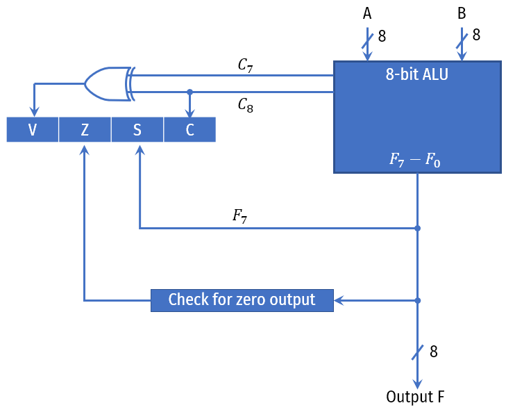

- Bit C (carry) is set to 1 if the end carry C8 is 1. It is cleared to 0 if the carry is 0.
- Bit S (sign) is set to 1 if the highest-order bit F7 is 1. It is set to 0 if the bit is 0.
- Bit Z (zero) is set to 1 if the output is zero and Z = 0 if the output is not zero.
- Bit V (overflow) is set to 1 if the exclusive-OR of the last two carries is equal to 1, and cleared to 0 otherwise. This is the condition for an overflow when negative numbers are in 2’s complement.

## Branch instructions dependent on status bit value.

| **Mnemonic** | **Branch Condition**  | **Tested Condition** |
| ------------ | --------------------- | -------------------- |
| BZ           | Branch if  zero       | Z = 1                |
| BNZ          | Branch if not zero    | Z = 0                |
| BC           | Branch if carry       | C = 1                |
| BNC          | Branch if no carry    | C = 0                |
| BP           | Branch if plus        | S = 0                |
| BM           | Branch if minus       | S = 1                |
| BV           | Branch if overflow    | V = 1                |
| BNV          | Branch if no overflow | V = 0                |

## Unsigned compare conditions

| **Mnemonic** | **Branch Condition**      | **Tested Condition** |
| ------------ | ------------------------- | -------------------- |
| BHI          | Branch if higher          | A > B                |
| BHE          | Branch if higher or equal | A ≥ B                |
| BLO          | Branch if lower           | A < B                |
| BLOE         | Branch if lower or equal  | A ≤ B                |
| BE           | Branch if equal           | A = B                |
| BNE          | Branch if not equal       | A ≠ B                |

## Signed compare conditions

| **Mnemonic** | **Branch Condition**       | **Tested Condition** |
| ------------ | -------------------------- | -------------------- |
| BGT          | Branch if greater than     | A > B                |
| BGE          | Branch if greater or equal | A ≥ B                |
| BLT          | Branch if less than        | A < B                |
| BLE          | Branch if less or equal    | A ≤ B                |
| BE           | Branch if equal            | A = B                |
| BNE          | Branch if not equal        | A ≠ B                |

# Program Interrupt

- The interrupt procedure is, in principle, quite similar to a subroutine call except for three variations: 
  - The interrupt is usually initiated by an internal or external signal rather than from the execution of an instruction 
  - The address of the interrupt service program is determined by the hardware rather than from the address field of an instruction
  - An interrupt procedure usually stores all the information necessary to define the state of the CPU rather than storing only the program counter. 
- After a program has been interrupted and the service routine been executed, the CPU must return to exactly the same state that it was when the interrupt occurred. Only if this happens will the interrupted program be able to resume exactly as if nothing had happened. 
- The state of the CPU at the end of the execute cycle (when the interrupt is recognized) is determined from:
  - The content of the program counter
  - The content of all processor registers
  - The content of certain status conditions
- There are three major types of interrupts that cause a break in the normal execution of a program. They can be classified as:
  - External interrupts
  - Internal interrupts
  - Software interrupts

## External Interrupt

- **External interrupts come from** 
  - Input-output (I/O) devices
  - Timing device
  - Circuit monitoring the power supply
  - Any other external source
- **Examples that cause external interrupts are** 
  - I/O device requesting transfer of data
  - I/O device finished transfer of data
  - Elapsed time of an event
  - Power failure
- External interrupts are asynchronous.
- External interrupts depend on external conditions that are independent of the program being executed at the time.

## Internal interrupts (Traps)

- **Internal interrupts arise from** 
  - Illegal or erroneous use of an instruction or data. 
- **Examples of interrupts caused by internal error conditions like**
  - Register overflow
  - Attempt to divide by zero
  - invalid operation code
  - stack overflow
  - protection violation.
- These error conditions usually occur as a result of a premature termination of the instruction execution.
- Internal interrupts are synchronous with the program. If the program is rerun, the internal interrupts will occur in the same place each time.

## Software interrupts

- Software Interrupt is invoked by the use of INT instruction. This event immediately stops execution of the program and passes execution over to the INT handler. 
- The INT handler is usually a part of the operating system and determines the action to be taken. 
- It occurs when an application program terminates or requests certain services from the operating system.
- Software interrupt is triggered by software and considered one of the ways to communicate with kernel or to trigger system calls, especially during error or exception handling.
- It is synchronous event.

# RISC & CISC

**Reduced Instruction Set Architecture (RISC)**

- The main idea behind this is to make hardware simpler by using an instruction set composed of a few basic steps for loading, evaluating, and storing operations just like a load command will load data, a store command will store the data. 

**Complex Instruction Set Architecture (CISC)**

- The main idea is that a single instruction will do all loading, evaluating, and storing operations just like a multiplication command will do stuff like loading data, evaluating, and storing it, hence it’s complex. 

## RISC and CISC Comparison

| RISC                                                        | CISC                                                         |
| ----------------------------------------------------------- | ------------------------------------------------------------ |
| Simpler instruction, hence simple instruction decoding.     | Complex instruction, hence complex instruction decoding.     |
| Instruction comes undersize of one word.                    | Instructions are larger than one-word size.                  |
| Fixed sized instructions                                    | Variable sized instructions                                  |
| Simple Addressing Modes.                                    | Complex Addressing Modes.                                    |
| Can perform only Register to Register Arithmetic operations | Can perform REG to REG or REG to MEM or MEM to MEM           |
| Requires more number of registers                           | Requires less number of registers                            |
| Code (program) size is large                                | Code (program) size is small                                 |
| Instruction takes a single clock cycle to get executed.     | Instruction may take more than a single clock cycle to get executed. |
| A pipeline processing can be achieved.                      | Pipeline processing can not be achieved.                     |

# Parallel Processing and Pipelining

- Parallel processing is a term used to denote a large class of techniques that are used to provide simultaneous data-processing tasks for the purpose of increasing the computational speed of a computer system.
- Instead of processing each instruction sequentially as in a conventional computer, a parallel processing system is able to perform concurrent data processing to achieve faster execution time.
- One of the method to achieve faster execution time is by using pipelining process.

- Pipelining is the process of accumulating instruction from the processor through a pipeline. It allows storing and executing instructions in an orderly process. It is also known as pipeline processing.
- Pipelining is a technique where multiple instructions are overlapped during execution. 
- Pipeline is divided into stages and these stages are connected with one another to form a pipe like structure. Instructions enter from one end and exit from another end.

- Pipelining increases the overall instruction throughput.
- It is like a modern day factory assembly line.
- There are two types of pipeline
  - Arithmetic Pipeline
  - Instruction Pipeline

## Instruction Pipeline

- In this a stream of instructions can be executed by overlapping fetch, decode and execute phases of an instruction cycle. This type of technique is used to increase the throughput of the computer system.
- An instruction pipeline reads instruction from the memory while previous instructions are being executed in other segments of the pipeline. Thus we can execute multiple instructions simultaneously. 
- The pipeline will be more efficient if the instruction cycle is divided into segments of equal duration. 

**For example Instruction execution can be divided into 5 stages.**

- **IF (Instruction Fetch)** - In the first subtask, the instruction is fetched.
- **ID (Instruction Decode)** - The fetched instruction is decoded in the second stage.
- **OF (Operand Fetch)** - In the third stage, the operands of the instruction are fetched.
- **IE (Instruction Execute)** - In the fourth, arithmetic and logical operation are performed on the operands to execute the instruction.
- **OS (Operand Store)** - In the fifth stage, the result is stored in memory.

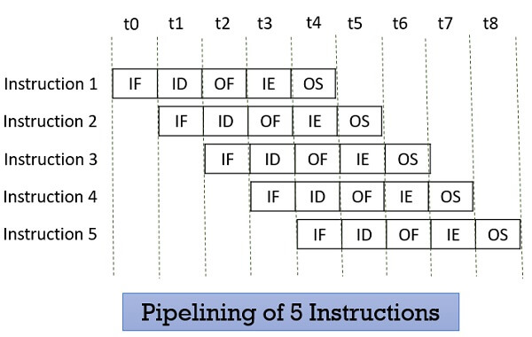
