# Table of contents

- [Input Output Interface](#input-output-interface)
- [Computer Peripherals](#computer-peripherals)
- [How data is represented in Computer?](#how-data-is-represented-in-computer)
- [I/O Interface](#io-interface)
- [Asynchronous Data Transfer](#asynchronous-data-transfer)
- [Strobe Control Method](#strobe-control-method)
  - [Source initiated strobe](#source-initiated-strobe)
  - [Destination initiated strobe](#destination-initiated-strobe)
- [Handshaking Method](#handshaking-method)
  - [Source initiated handshaking](#source-initiated-handshaking)
  - [Destination initiated handshaking](#destination-initiated-handshaking)
- [Advantages of Asynchronous Data Transfer](#advantages-of-asynchronous-data-transfer)
- [Data Transfer](#data-transfer)
  - [Serial Data Transfer](#serial-data-transfer)
  - [Parallel Data Transfer](#parallel-data-transfer)
- [Serial Data Transfer v/s Parallel Data Transfer](#serial-data-transfer-vs-parallel-data-transfer)
- [Asynchronous serial data transfer](#asynchronous-serial-data-transfer)
- [Modes of Transfer](#modes-of-transfer)
- [Programmed I/O](#programmed-io)
  - [Example of Programmed I/O](#example-of-programmed-io)
- [Interrupt - initiated I/O](#interrupt---initiated-io)
- [Direct Memory Access](#direct-memory-access)
- [Input Output Processor (IOP)](#input-output-processor-iop)

# Unit - 5  Input Output Organization

# Input Output Interface

- The input-output subsystem of a computer, referred to as I/O, provides an efficient mode of communication between the central system and the outside environment. 

- Programs and data must be entered into computer memory for processing and results obtained from computations must be recorded or displayed for the user. 

- A computer serves no useful purpose without the ability to receive information from an outside source and to transmit results in a meaningful form.

# Computer Peripherals

- In real world most CPU need to take input from outside or send the output to outside of CPU to different devices.

- This devices are not part of Computer and known as Peripheral devices. They help user for input/output.

- Input Output Devices can be categorized into 3 categories
  - Input (Keyboard, Mouse, Scanner, etc.)

  - Output (Screen, Printer, etc.)

  - Input – Output (Touch Screen, Hard Disk, etc)

# How data is represented in Computer?

- Generally ASCII / Unicode format is used to represent data in IO devices.

- ASCII is 7 bit character contains
  - 94 Printable characters
    - Alphabets (Uppercase, Lowercase)

    - Numbers

    - Symbols

    - Etc.

- 34 Non printable characters
  - Space, New lines, Start of Text, End of Text etc.

# I/O Interface

- Computer peripheral devices uses different format to store the data compared to CPU
- Most I/O devices are mostly electro-magnetic or electro-mechanical devices.
- Hence to communicate with CPU we require special hardware which can convert signal to proper format, this hardware is known as I/O Interface.

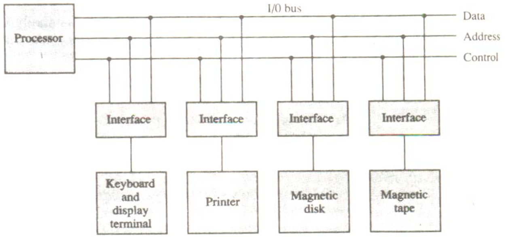

> Figure: How I/O devices are connected to CPU via Interface

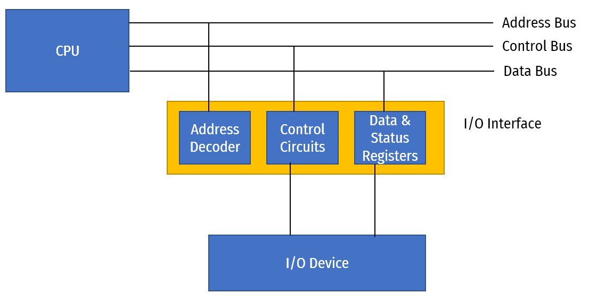

> Figure: Parts of I/O Interface and its connection to CPU and I/O Device

# Asynchronous Data Transfer

- All internal operation of different units i.e CPU, Memory, I/O etc. are controlled and synchronize using a clock pulse.
- Clock pulse is given to all component to properly manage data transfer.
- E.g. clock pulse is given to all registers, and all data transfer among registers occurs simultaneously during the occurrence of the clock pulse.

- If all digital system like, registers, I/O etc. using the same clock pulse i.e. CPU clock pulse then the data transfer between these system is known as Synchronous Data Transfer.

- But in most cases I/O devices are designed independently of CPU and generally do not share the same clock pulse as CPU. In this case the data transfer between registers and I/O is called Asynchronous Data Transfer

- But the Asynchronous data transfer between two independent units requires that control signals to be transmitted between the communicating units so that the time can be indicated at which they send data.

- There are two methods which is used to achieve asynchronous way of data transfer.

- **Strobe Control**
  - A strobe pulse is supplied by one unit to indicate to the other unit when the data transfer has to occur.

- **Handshaking**
  - It is used to accompany each data item being transferred with a control signal that indicates data in the bus. The unit receiving the data items responds with another signal to acknowledge receipt of the data.

- This methods are not only restricted to register to IO data transfer, but also used in other units of computer as well.

# Strobe Control Method

- The Strobe Control method of asynchronous data transfer employs a single control line to time each transfer. This control line is also known as a strobe, and it may be achieved either by source or destination, depending on which initiate the transfer.

## Source initiated strobe

- In the below block diagram, you can see that strobe is initiated by source, and as shown in the timing diagram, the source unit first places the data on the data bus.

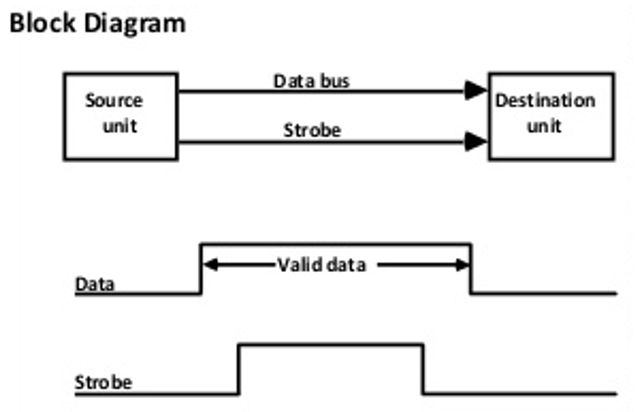

- After a brief delay to ensure that the data resolve to a stable value, the source activates a strobe pulse. The information on the data bus and strobe control signal remains in the active state for a sufficient time to allow the destination unit to receive the data.

## Destination initiated strobe

- In the below block diagram, you see that the strobe initiated by destination, and in the timing diagram, the destination unit first activates the strobe pulse, informing the source to provide the data.

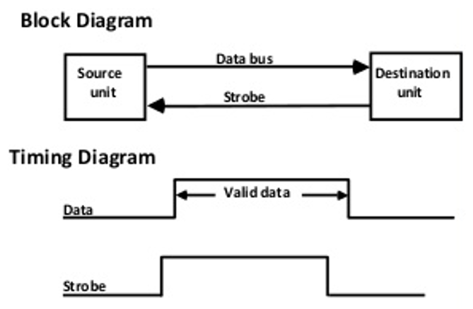

- The source unit responds by placing the requested binary information on the data bus. The data must be valid and remain on the bus long enough for the destination unit to accept it.

# Handshaking Method

- The strobe method has the disadvantage that the source unit that initiates the transfer has no way of knowing whether the destination has received the data that was placed in the bus.

- Similarly, a destination unit that initiates the transfer has no way of knowing whether the source unit has placed data on the bus.

- This problem is solved by the handshaking method. The handshaking method introduces a second control signal line that replays the unit that initiates the transfer.

- In this method, one control line is in the same direction as the data flow in the bus from the source to the destination. The source unit uses it to inform the destination unit whether there are valid data in the bus.

- The other control line is in the other direction from the destination to the source. This is because the destination unit uses it to inform the source whether it can accept data. And in it also, the sequence of control depends on the unit that initiates the transfer. So it means the sequence of control depends on whether the transfer is initiated by source and destination.

## Source initiated handshaking

- In the below block diagram, you can see that two handshaking lines are "data valid", which is generated by the source unit, and "data accepted", generated by the destination unit.

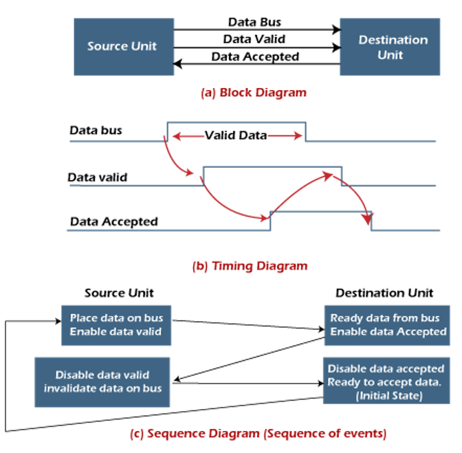

- The timing diagram shows the timing relationship of the exchange of signals between the two units. The source initiates a transfer by placing data on the bus and enabling its data valid signal. The destination unit then activates the data accepted signal after it accepts the data from the bus.

- The source unit then disables its valid data signal, which invalidates the data on the bus.

- After this, the destination unit disables its data accepted signal, and the system goes into its initial state. The source unit does not send the next data item until after the destination unit shows readiness to accept new data by disabling the data accepted signal.

- This sequence of events described in its sequence diagram, which shows the above sequence in which the system is present at any given time.

## Destination initiated handshaking

- In the below block diagram, you see that the two handshaking lines are "data valid", generated by the source unit, and "ready for data" generated by the destination unit. Note that the name of signal data accepted generated by the destination unit has been changed to ready for data to reflect its new meaning.

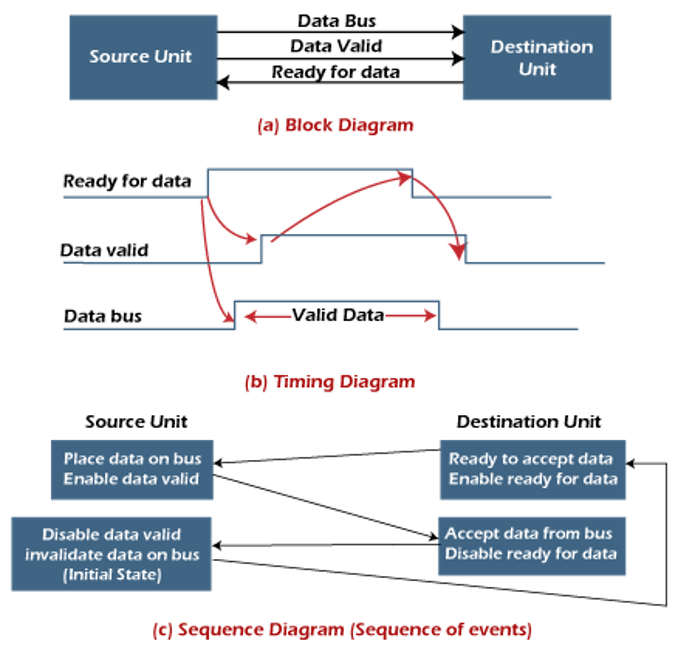

# Advantages of Asynchronous Data Transfer

- It is more flexible, and devices can exchange information at their own pace. In addition, individual data characters can complete themselves so that even if one packet is corrupted, its predecessors and successors will not be affected.

- It does not require complex processes by receiving and sending devices. It uses a simple signal to indicate the data transfer, so both devices can keep up with the data stream.

# Data Transfer

- Data Transfer is to transmit the data from one unit to another unit.
- Data Transfer can be done in two ways.
  - Serial Data Transfer

  - Parallel Data Transfer

## Serial Data Transfer

- In this type of transmission a single link is used to transmit data bits and only one bit is transferred at a time.
- All the bits are transferred using a single link one bit at a time bit by bit

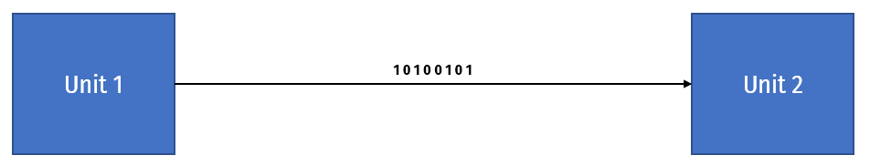

## Parallel Data Transfer

- In this transmission, data bits are transmitted simultaneously through multiple links, which are placed parallel to each other. Contrary to serial transmission where only one bit is transmitted at a time, multiple bits of data can be transmitted simultaneously in parallel transmission.

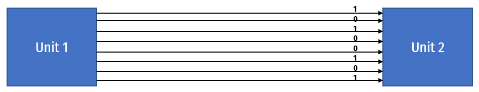

# Serial Data Transfer v/s Parallel Data Transfer

| Serial Data Transfer | Parallel Data Transfer |
| ---------------------- | -------------------------- |
| **Low Speed :** Serial Data transfer is done by low speed compared to Parallel Data Transfer as there is only one link and all the bits are transferred one by one. | **High Speed:** Parallel data transfer is done by high speed compared to Serial Data Transfer as all the bits are transferred simultaneously using multiple links. |
| **Low Cost :** Construction cost is low as only single link is required for connection. | **High Cost :** Construction cost is many times higher as multiple links are required for connection. |
| **High Distance :** Used to transfer data at high distance as it is easier and cheaper to build. | **Low Distance :** Used to transfer data at low distance as it is complex and costlier to build. |
| Generally used to connect I/O devices to Memory or CPU | Generally used to connect memory to CPU for high speed data transfer. |
| **Long Cable Length :** The serial communication cables are longer, thinner, and economical. | **Short Cable Length :** The serial communication cables are shorter, thicker, and costlier. |

# Asynchronous serial data transfer

- In most computer asynchronous mode of data transfer is used in which two component have a different clock. 
- In serial transfer each bit is send one at a time. To tell other devices when the character/data will be given a concept of start and end bit is used. 
- A start bit is denoted by 0 and stop bit is detected when line return to 1-state at least one time, here 1-state means that there is not data transfer is occurring.
- When a character is not being sent then line is kept in state 1. Start of character is detected when a 0 is sent. The character bit always come after 0 bit. After last bit is sent the state of line to become 1.

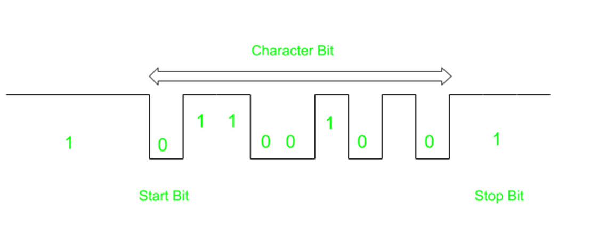

# Modes of Transfer

- The method that is used to transfer information between internal storage and external I/O devices is known as I/O interface.

- The binary information that is received from an external device is usually stored in the memory unit.

- The information that is transferred from the CPU to the external device is originated from the memory unit. 

- CPU merely processes the information but the source and target is always the memory unit. 

- Data transfer between CPU and the I/O devices may be done in different modes. Data transfer to and from the peripherals may be done in any of the three possible ways
  - Programmed I/O.

  - Interrupt- initiated I/O.

  - Direct memory access (DMA).

# Programmed I/O

- It is due to the result of the I/O instructions that are written in the computer program. 

- Each data item transfer is initiated by an instruction in the program to access register or memory on a device. 

- Transferring data under program control requires constant monitoring of I/O devices by the CPU.

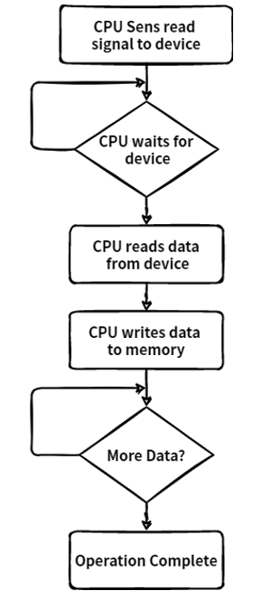

## Example of Programmed I/O

- In this case, the I/O device does not have direct access to the memory unit. 

- A transfer from I/O device to memory requires the execution of several instructions by the CPU, including an input instruction to transfer the data from device to the CPU and store instruction to transfer the data from CPU to memory. 

- In programmed I/O, the CPU stays in the program loop until the I/O unit indicates that it is ready for data transfer. 

- This is a time consuming process since it needlessly keeps the CPU busy.

- This situation can be avoided by using an interrupt facility. 

# Interrupt - initiated I/O

- Since in the above case we saw the CPU is kept busy unnecessarily. This situation can very well be avoided by using an interrupt driven method for data transfer. 
- By using interrupt facility and special commands to inform the interface to issue an interrupt request signal whenever data is available from any device. 
- In the meantime the CPU can proceed for any other program execution. The interface meanwhile keeps monitoring the device. 
- Whenever it is determined that the device is ready for data transfer it initiates an interrupt request signal to the computer. Upon detection of an external interrupt signal the CPU stops momentarily the task that it was already performing, branches to the service program to process the I/O transfer, and then return to the task it was originally performing. 

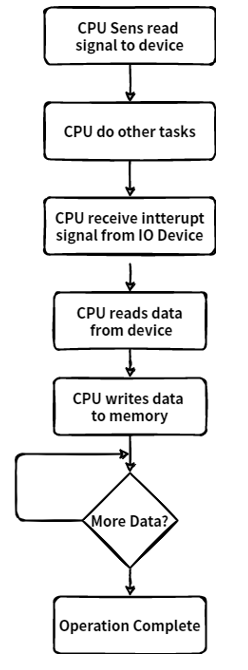

> Note : Both the methods programmed I/O and Interrupt-driven I/O require the active intervention of the processor to transfer data between memory and the I/O module, and any data transfer must transverse a path through the processor.

# Direct Memory Access

- Interrupt driven and programmed I/O require active CPU intervention

- Transfer rate is limited (processor to test and service the device)

- CPU is tied up for managing I/O transfer.

- DMA Controller is a hardware device that allows I/O devices to directly access memory with less participation of the processor. This allow faster data transfer between fast storage media such as hard disks or SSDs. Particularly useful to transfer large chunk of data.

- This type of approach is known as DMA or Direct Memory Access

- DMA means CPU grants I/O interface an authority to read from or to write to memory directly which handles by DMA controller.
- During DMA the CPU is idle and it has no control over the memory buses. The DMA controller takes over the buses to manage the transfer directly between the I/O devices and the memory unit.

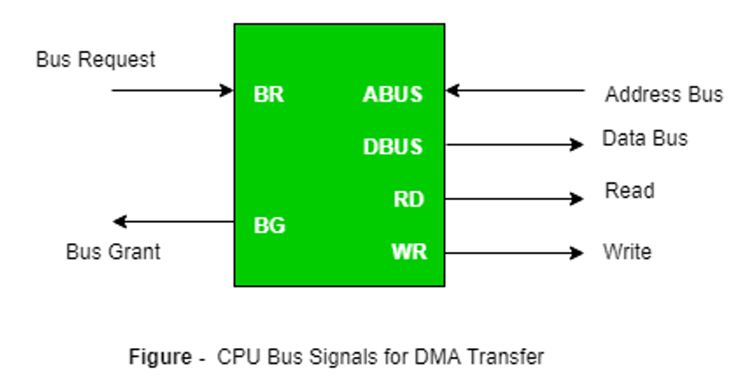

# Input Output Processor (IOP)

- In all previous methods of data transfer like Programmed IO, Interrupt IO, DMA need some CPU intervention to complete the IO operation.
- To overcome this drawback or completely remove CPU from IO operation Input Output Processor is used.
- An input-output processor (IOP) is a processor with direct memory access capability. 
- IOP is similar to regular CPU except it only handles IO instructions. IOP can fetch, decode and execute all IO operations.

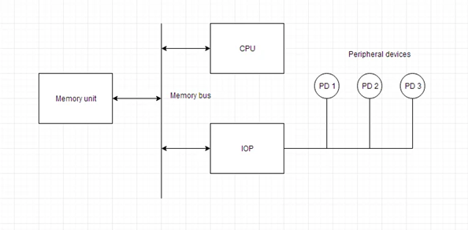

> Figure: Block Diagram of Input Output Processor

- Above is a block diagram of IOP along with all other units like memory, CPU and IO devices.

- Here memory unit can communicate directly with both processor, CPU and IOP.

- CPU processes the data which requires computational processing.

- When IO operation is required CPU transfers the control of IO operation to IOP and CPU continues the other task on hand.

- Meanwhile IOP completes the IO operation and sends back the control using interrupt to CPU along with the status of IO operation.

- The CPU can act as master and the IOP act as slave processor.

- The CPU assigns the task of initiating operations but it is the IOP, who executes the instructions, and not the CPU

- CPU instructions provide operations to start an I/O transfer.