# Table of contents

- [Memory Hierarchy](#memory-hierarchy)
- [Main Memory (RAM & ROM)](#main-memory-ram--rom)
  - [Read Only Memory (ROM)](#read-only-memory-rom)
- [Random access memory (RAM)](#random-access-memory-ram)
- [Memory Address Map](#memory-address-map)
- [Auxiliary Memory](#auxiliary-memory)
  - [Magnetic Disks](#magnetic-disks)
- [Magnetic Tape](#magnetic-tape)
- [Associative Memory](#associative-memory)
- [Cache Memory](#cache-memory)
- [Cache Mapping](#cache-mapping)
- [Cache Mapping Techniques](#cache-mapping-techniques)
- [Direct Mapping](#direct-mapping)
- [Fully Associative Mapping](#fully-associative-mapping)
- [Set Associative Mapping](#set-associative-mapping)
- [Virtual Memory](#virtual-memory)

# Unit - 6  Memory Organization

# Memory Hierarchy

- In the Computer System Design, Memory Hierarchy is an enhancement to organize the memory such that it can minimize the access time.

- Below is the diagram that shows different types of memories used in computer system.

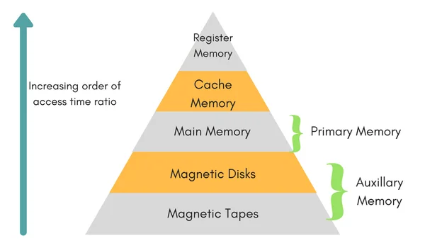

- This Memory Hierarchy Design is divided into 2 main types:
  - External Memory (Secondary Memory)
    - Comprising of Magnetic Disk, Optical Disk, Magnetic Tape i.e. peripheral storage devices which are accessible by the processor via I/O Module

  - Internal Memory (Primary Memory)
    - Internal Memory or Primary Memory – Comprising of Main Memory, Cache Memory & CPU registers. This is directly accessible by the processor.

- We can observe that as we go from top level to bottom 
  - Read/Write speed decrease

  - Cost per byte decrease

  - Access time increase

  - Capacity Increase

# Main Memory (RAM & ROM)

## Read Only Memory (ROM)

- A read-only memory (ROM) is essentially a memory device in which permanent binary information is stored.
- The binary information is generally specified by the manufacturer and is then embedded in the computer system. 
- A ROM which can be re programmed is called a PROM. The process of entering information in a ROM is known as programming. 
- ROMs are used to store information i.e. firmware, BIOS etc.

- Used in computers for the temporary storage of programs and data.
- Read and write both operations are performed by RAM which requires fast cycle times as not to slow down the computer operation.
- It is volatile and lose all stored information if power is interrupted or turned off.
- RAM chip typically come with word capacities of 1K, 4K, 8K, 16K, etc.. and word sizes of 1, 4 or 8-bits.
- It can be expanded by combining several memory chips.

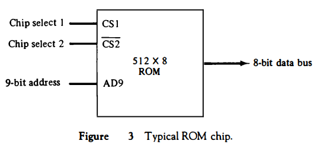

> Figure: Block Diagram of ROM

# Random access memory (RAM)

| **Static RAM**                                               | **Dynamic RAM**                                              |
| ------------------------------------------------------------ | ------------------------------------------------------------ |
| 1. SRAM has lower access time, so  it is faster compared to DRAM. | 1. DRAM has higher access time,  so it is slower than SRAM.  |
| 2. SRAM is costlier than DRAM.                               | 2. DRAM costs less compared to  SRAM.                        |
| 3. SRAM requires constant power supply,  which means this type of memory consumes more power. | 3. DRAM offers reduced power  consumption, due to the fact that the information is stored in the capacitor. |
| 4. Due to complex internal circuitry, less  storage capacity is available compared to the same physical size of DRAM  memory chip. | 4. Due to the small internal  circuitry in the one-bit memory cell of DRAM, the large storage capacity is  available. |
| 5. SRAM has low packaging  density.                          | 5. DRAM has high packaging  density.                         |
| 6. No need to refresh  periodically.                         | 6. Due to capacitor used as  storage element, information may lose over period of time. So, need to  refresh periodically. |

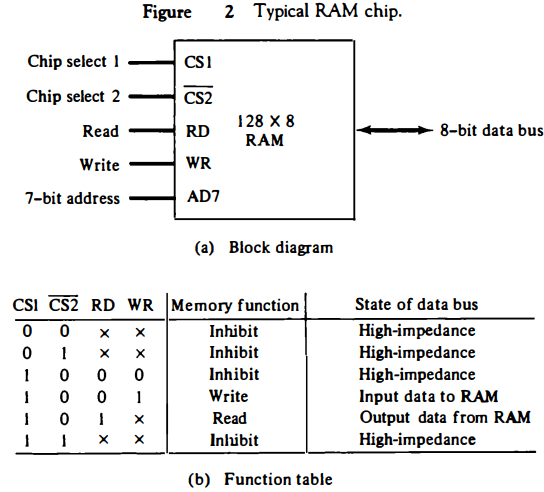

> Figure: Block Diagram of RAM

# Memory Address Map

- The designer of a computer system must calculate the amount of memory required for the particular application and assign it to either RAM or ROM.
- The interconnection between memory and processor is then established from knowledge of the size of memory needed and the type of RAM and ROM chips available.
- The addressing of memory can be established by means of a table that specifies the memory address assigned to each chip.
- The table, called a memory address map, is a pictorial representation of assigned address space for each chip in the system. 

- To demonstrate with a particular example, assume that a computer system needs 512 bytes of RAM and 512 bytes of ROM.

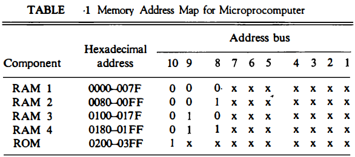

> Figure: Memory Address Map

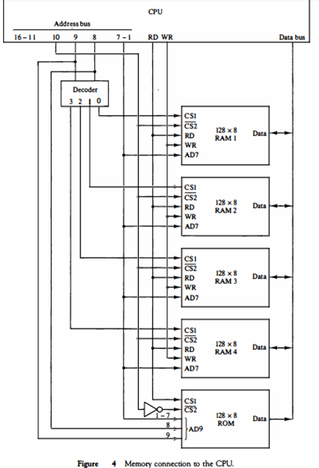

> Multiple Memory chip connection for above configuration

# Auxiliary Memory

- An Auxiliary memory is referred to as the lowest-cost, highest-space, and slowest-approach storage in a computer system.

- It is where programs and information are preserved for long-term storage or when not in direct use.

- The most typical auxiliary memory devices used in computer systems are magnetic disks, optical disk and tapes etc.

## Magnetic Disks

- A magnetic disk is a round plate generated of metal or plastic coated with magnetized material. 
- There are both sides of the disk are used and multiple disks can be stacked on one spindle with read/write heads accessible on each surface.

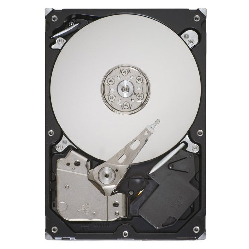

> Figure: Mechanical Hard Disk

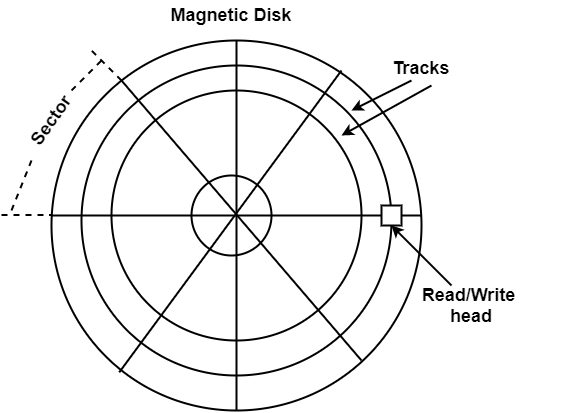

> Figure: Block Diagram of Hard disk showing, Read Write Head, Sectors and Track on platter

- All disks revolve together at high speed and are not stopped or initiated for access purposes.
- Generally disk revolve at speed of 5200 RPM or 7200 RPM
- Read and Write operation is performed using Read/Write Head 
- Bits are saved in the magnetized surface in marks along concentric circles known as tracks. 

- All disks revolve together at high speed and are not stopped or initiated for access purposes.
- Generally disk revolve at speed of 5200 RPM or 7200 RPM
- Read and Write operation is performed using Read/Write Head 
- Bits are saved in the magnetized surface in marks along concentric circles known as tracks. 

# Magnetic Tape

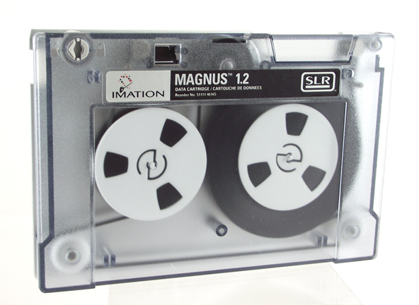

> Figure: Magnetic Tape

- The tape is a layer of plastic coated with a magnetic documentation medium where bits can be stored.
- Bits are listed as a magnetic stain on the tape along various tracks.

- Magnetic tape units can be stopped, initiated to move forward, or in the opposite, or it can be reversed.
- Speed of tape can not be changed to perform faster data read/write.

# Associative Memory

- In most cases, data in any memory is accessed using its location (address).
- On other hand, 
- An associative memory can be treated as a memory unit whose saved information can be accessed/searched by the content of the information itself instead of by an address or memory location.

- Block diagram of associative memory is shown here.

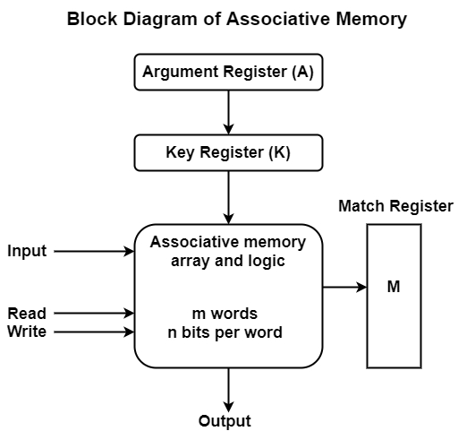

> Figure: Block Diagram of Associative Memory

- It includes a memory array and logic for m words with n bits per word. 
- The argument register A and key register K each have n bits, one for each bit of a word.

- The match register M has m bits, one for each memory word. Each word in memory is related in parallel with the content of the argument register.

- The words that connect the bits of the argument register set an equivalent bit in the match register. 

- After the matching process, those bits in the match register that have been set denote the fact that their equivalent words have been found.

- Searching is done in parallel way for all the location simultaneously.
- After searching Reading is done in sequential access to memory for those words whose equivalent bits in the match register have been set.

- The key register supports a mask for selecting a specific field or key in the argument word. 
- The whole argument is distinguished with each memory word if the key register includes all 1’s.
- Hence, there are only those bits in the argument that have 1's in their equivalent position of the key register are compared.

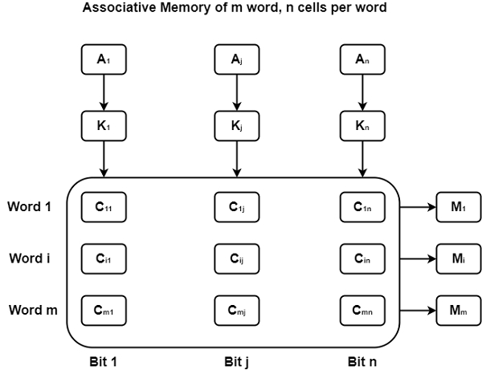

> Figure: Associative Memory of m word, each word having n bit

# Cache Memory

- Speed of Primary memory is slower compared to the processing power of CPU. 
- To improve the performance of CPU processing cache memory is used as a buffer between CPU and Primary memory.
- Cache is way more faster compare to primary memory and also it is cheaper to CPU registers. So cache is used as a buffer between CPU and primary memory to increase the performance of CPU.

- **What Cache memory contains?**
  - The data or contents of the main memory that are used frequently by CPU are stored in the cache memory so that the processor can easily access that data in a shorter time. 
  - Whenever the CPU needs to access memory, it first checks the cache memory. If the data is not found in cache memory, then the CPU moves into the main memory. 

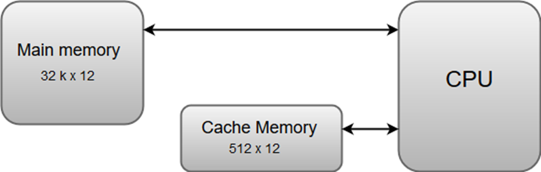

> Figure: Cache Memory

- **The basic operation of a cache memory is as follows:**
  - When the CPU needs to access memory, the cache is examined. If the word is found in the cache, it is read from the fast memory.
  - If the word addressed by the CPU is not found in the cache, the main memory is accessed to read the word.
  - A block of words one just accessed is then transferred from main memory to cache memory. The block size may vary from one word (the one just accessed) to about 16 words adjacent to the one just accessed.
  - The performance of the cache memory is frequently measured in terms of a quantity called hit ratio.
  - When the CPU refers to memory and finds the word in cache, it is said to produce a hit.
  - If the word is not found in the cache, it is in main memory and it counts as a miss.
  - The ratio of the number of hits divided by the total CPU references to memory (hits plus misses) is the hit ratio. 

# Cache Mapping

- Cache mapping defines how a block from the main memory is mapped to the cache memory in case of a cache miss.
- OR
- Cache mapping is a technique by which the contents of main memory are brought into the cache memory

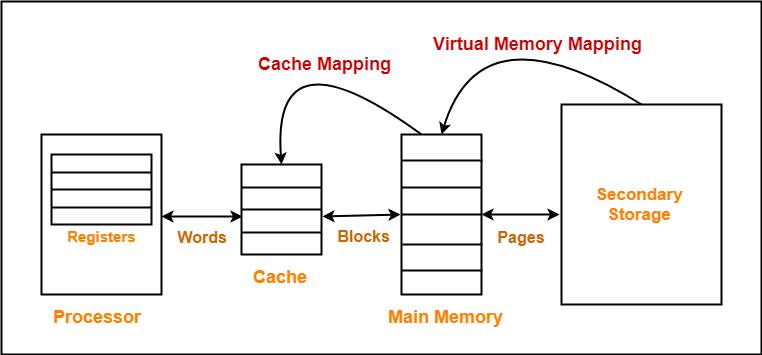

> Important Note to remember: 
>
> Main memory is divided into equal size partitions called as blocks or frames.
>
> Cache memory is divided into partitions having same size as that of blocks called as lines.

# Cache Mapping Techniques

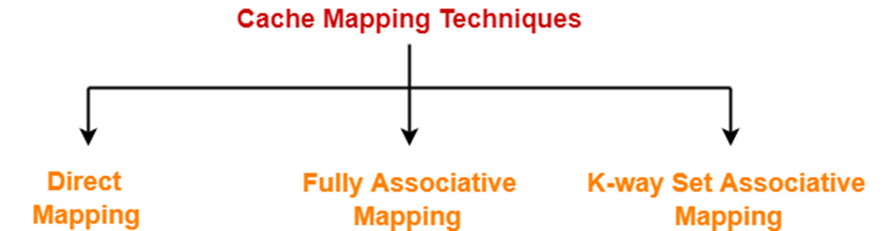

# Direct Mapping

- In direct mapping,
  - A particular block of main memory can map only to a particular line of the cache.
  - The line number of cache to which a particular block can map is given by-
  - **Cache line number = ( Main Memory Block Address ) % (Number of lines in Cache)**

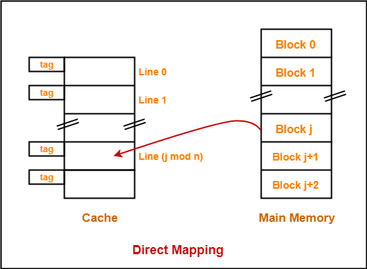

- Consider cache memory is divided into ‘n’ number of lines.

- Then, block ‘j’ of main memory can map to line number (j mod n) only of the cache.

- **Need of Replacement Algorithm**
  - There is no need of any replacement algorithm.
  - This is because a main memory block can map only to a particular line of the cache.
  - Thus, the new incoming block will always replace the existing block (if any) in that particular line.

- **Division of Physical Address**

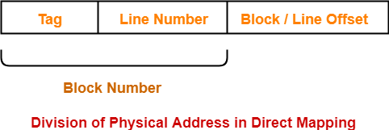

# Fully Associative Mapping

- In fully associative mapping,
  - A block of main memory can map to any line of the cache that is freely available at that moment.

  - This makes fully associative mapping more flexible than direct mapping

- **Example**

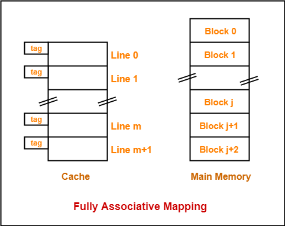

- All the lines of cache are freely available.
- Thus, any block of main memory can map to any line of the cache.
- Had all the cache lines been occupied, then one of the existing blocks will have to be replaced.

- **Need of Replacement Algorithm**
  - A replacement algorithm is required.

  - Replacement algorithm suggests the block to be replaced if all the cache lines are occupied.

  - Thus, replacement algorithm like FIFO, Round Robin etc. algorithms are used.

- **Division of Physical Address**

# Set Associative Mapping

- In set associative mapping,
  - Cache lines are grouped into sets where each set contains k number of lines.

  - A particular block of main memory can map to only one particular set of the cache.

  - However, within that set, the memory block can map any cache line that is freely available.

  - The set of the cache to which a particular block of the main memory can map is given by-

  - **Cache set number = ( Main Memory Block Address ) % (Number of sets in Cache)**

- **Example**

- Here k = 2 suggests that each set contains two cache lines.
- Since cache contains 6 lines, so number of sets in the cache = 6 / 2 = 3 sets.
- Block ‘j’ of main memory can map to set number (j mod 3) only of the cache.
- Within that set, block ‘j’ can map to any cache line that is freely available at that moment.
- If all the cache lines are occupied, then one of the existing blocks will have to be replaced.

- **Division of Physical Address**

# Virtual Memory

- Virtual Memory is a storage scheme that provides user an illusion of having a very big main memory. This is done by treating a part of secondary memory as the main memory.
- Virtual memory is a valuable concept in computer architecture that allows you to run large, sophisticated programs on a computer even if it has a relatively small amount of RAM
- Instead of loading one big process in the main memory, the Operating System loads the different parts of more than one process in the main memory.

- A computer with virtual memory artfully juggles the conflicting demands of multiple programs within a fixed amount of physical memory.

- A PC with small amount of RAM can run more program which can be beyond the capacity of RAM by using the virtual memory. (Program will generally run slower)

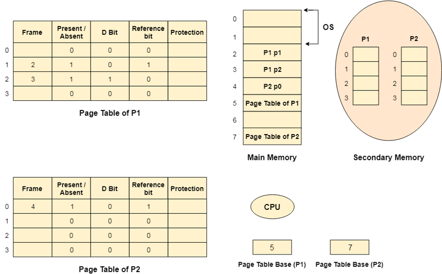